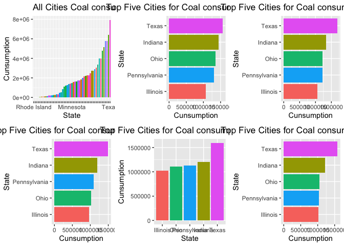
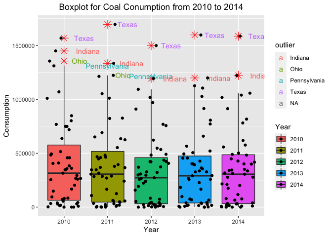
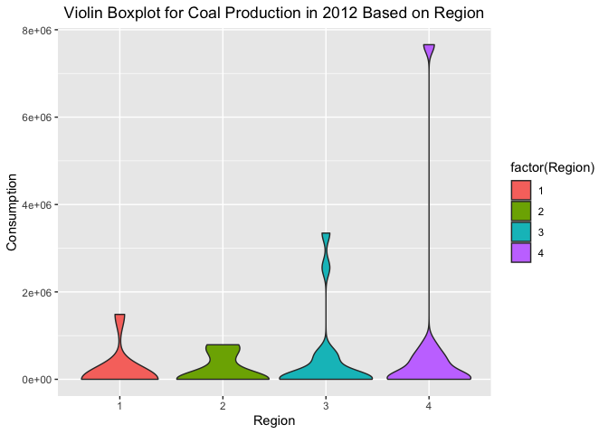
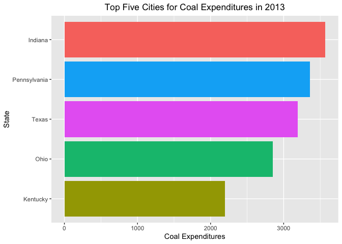
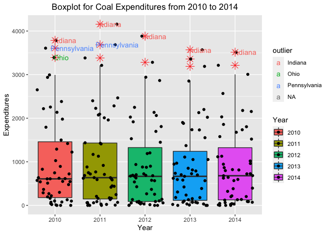
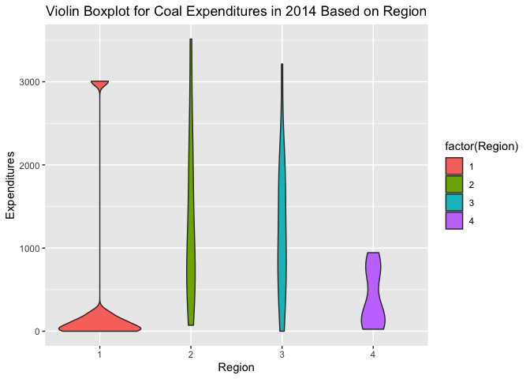
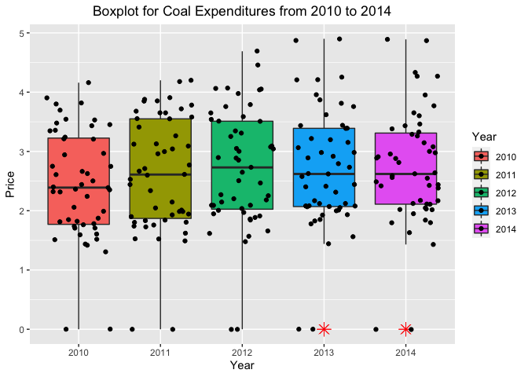
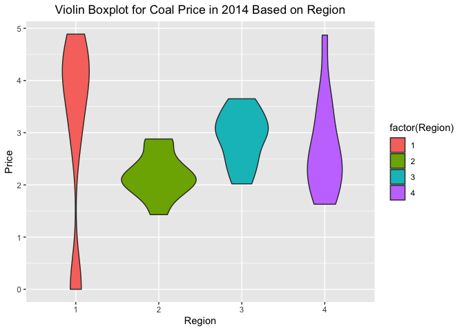
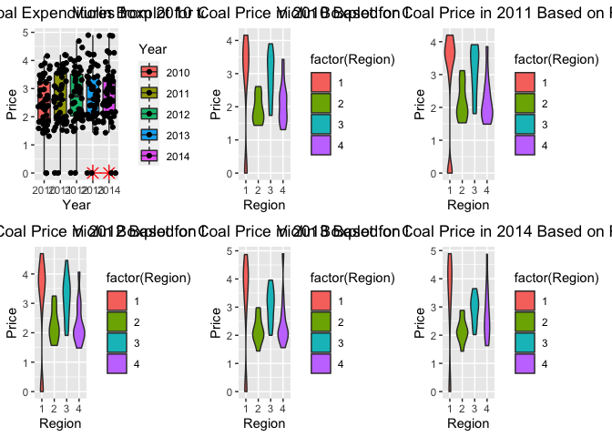

Eda\_Final\_Coal\_Peter
================
Zhengqi Tian
11/18/2021

``` r
library(ggdemetra)
```

    ## Loading required package: ggplot2

``` r
library(tidyverse)
```

    ## ── Attaching packages ─────────────────────────────────────── tidyverse 1.3.1 ──

    ## ✓ tibble  3.1.4     ✓ dplyr   1.0.7
    ## ✓ tidyr   1.1.3     ✓ stringr 1.4.0
    ## ✓ readr   2.0.1     ✓ forcats 0.5.1
    ## ✓ purrr   0.3.4

    ## ── Conflicts ────────────────────────────────────────── tidyverse_conflicts() ──
    ## x dplyr::filter() masks stats::filter()
    ## x dplyr::lag()    masks stats::lag()

``` r
library(ggplot2)
library(ggpubr)
```

``` r
data <- read_csv("Energy Census and Economic Data US 2010-2014.csv")
```

    ## Rows: 52 Columns: 192

    ## ── Column specification ────────────────────────────────────────────────────────
    ## Delimiter: ","
    ## chr   (2): StateCodes, State
    ## dbl (190): Region, Division, Coast, Great Lakes, TotalC2010, TotalC2011, Tot...

    ## 
    ## ℹ Use `spec()` to retrieve the full column specification for this data.
    ## ℹ Specify the column types or set `show_col_types = FALSE` to quiet this message.

``` r
head(data)
```

    ## # A tibble: 6 × 192
    ##   StateCodes State      Region Division Coast `Great Lakes` TotalC2010 TotalC2011
    ##   <chr>      <chr>       <dbl>    <dbl> <dbl>         <dbl>      <dbl>      <dbl>
    ## 1 AL         Alabama         3        6     1             0    1931522    1905207
    ## 2 AK         Alaska          4        9     1             0     653221     653637
    ## 3 AZ         Arizona         4        8     0             0    1383531    1424944
    ## 4 AR         Arkansas        3        7     0             0    1120632    1122544
    ## 5 CA         California      4        9     1             0    7760629    7777115
    ## 6 CO         Colorado        4        8     0             0    1513547    1470445
    ## # … with 184 more variables: TotalC2012 <dbl>, TotalC2013 <dbl>,
    ## #   TotalC2014 <dbl>, TotalP2010 <dbl>, TotalP2011 <dbl>, TotalP2012 <dbl>,
    ## #   TotalP2013 <dbl>, TotalP2014 <dbl>, TotalE2010 <dbl>, TotalE2011 <dbl>,
    ## #   TotalE2012 <dbl>, TotalE2013 <dbl>, TotalE2014 <dbl>, TotalPrice2010 <dbl>,
    ## #   TotalPrice2011 <dbl>, TotalPrice2012 <dbl>, TotalPrice2013 <dbl>,
    ## #   TotalPrice2014 <dbl>, TotalC10-11 <dbl>, TotalC11-12 <dbl>,
    ## #   TotalC12-13 <dbl>, TotalC13-14 <dbl>, TotalP10-11 <dbl>, …

``` r
str(data)
```

    ## spec_tbl_df [52 × 192] (S3: spec_tbl_df/tbl_df/tbl/data.frame)
    ##  $ StateCodes           : chr [1:52] "AL" "AK" "AZ" "AR" ...
    ##  $ State                : chr [1:52] "Alabama" "Alaska" "Arizona" "Arkansas" ...
    ##  $ Region               : num [1:52] 3 4 4 3 4 4 1 3 3 3 ...
    ##  $ Division             : num [1:52] 6 9 8 7 9 8 1 5 5 5 ...
    ##  $ Coast                : num [1:52] 1 1 0 0 1 0 1 1 1 1 ...
    ##  $ Great Lakes          : num [1:52] 0 0 0 0 0 0 0 0 0 0 ...
    ##  $ TotalC2010           : num [1:52] 1931522 653221 1383531 1120632 7760629 ...
    ##  $ TotalC2011           : num [1:52] 1905207 653637 1424944 1122544 7777115 ...
    ##  $ TotalC2012           : num [1:52] 1879716 649341 1395839 1067642 7564063 ...
    ##  $ TotalC2013           : num [1:52] 1919365 621107 1414383 1096438 7665241 ...
    ##  $ TotalC2014           : num [1:52] 1958221 603119 1422590 1114409 7620082 ...
    ##  $ TotalP2010           : num [1:52] 1419613 1738207 580948 1247709 2532205 ...
    ##  $ TotalP2011           : num [1:52] 1400108 1641980 617956 1391190 2634789 ...
    ##  $ TotalP2012           : num [1:52] 1433370 1563102 598039 1472778 2334863 ...
    ##  $ TotalP2013           : num [1:52] 1463647 1513859 594994 1432074 2390424 ...
    ##  $ TotalP2014           : num [1:52] 1353725 1475129 635050 1454325 2413494 ...
    ##  $ TotalE2010           : num [1:52] 21630 6474 19373 12269 117090 ...
    ##  $ TotalE2011           : num [1:52] 24448 8050 22629 14179 135098 ...
    ##  $ TotalE2012           : num [1:52] 24193 7884 22872 13756 135932 ...
    ##  $ TotalE2013           : num [1:52] 24127 7282 22841 14102 137051 ...
    ##  $ TotalE2014           : num [1:52] 24146 6891 22610 13885 137720 ...
    ##  $ TotalPrice2010       : num [1:52] 17.8 20.1 22.2 16.9 21 ...
    ##  $ TotalPrice2011       : num [1:52] 20.1 24.9 25.6 19.7 24.4 ...
    ##  $ TotalPrice2012       : num [1:52] 20 25.1 26.4 20 25 ...
    ##  $ TotalPrice2013       : num [1:52] 19 24.6 26.1 19.5 24.9 ...
    ##  $ TotalPrice2014       : num [1:52] 18.6 24.4 25.9 18.9 25.3 ...
    ##  $ TotalC10-11          : num [1:52] 98.6 100.1 103 100.2 100.2 ...
    ##  $ TotalC11-12          : num [1:52] 98.7 99.3 98 95.1 97.3 ...
    ##  $ TotalC12-13          : num [1:52] 102.1 95.7 101.3 102.7 101.3 ...
    ##  $ TotalC13-14          : num [1:52] 102 97.1 100.6 101.6 99.4 ...
    ##  $ TotalP10-11          : num [1:52] 98.6 94.5 106.4 111.5 104.1 ...
    ##  $ TotalP11-12          : num [1:52] 102.4 95.2 96.8 105.9 88.6 ...
    ##  $ TotalP12-13          : num [1:52] 102.1 96.8 99.5 97.2 102.4 ...
    ##  $ TotalP13-14          : num [1:52] 92.5 97.4 106.7 101.6 101 ...
    ##  $ TotalE10-11          : num [1:52] 113 124 117 116 115 ...
    ##  $ TotalE11-12          : num [1:52] 99 97.9 101.1 97 100.6 ...
    ##  $ TotalE12-13          : num [1:52] 99.7 92.4 99.9 102.5 100.8 ...
    ##  $ TotalE13-14          : num [1:52] 100.1 94.6 99 98.5 100.5 ...
    ##  $ TotalPrice10-11      : num [1:52] 113 124 115 116 116 ...
    ##  $ TotalPrice11-12      : num [1:52] 99.3 100.7 103.1 101.6 102.5 ...
    ##  $ TotalPrice12-13      : num [1:52] 95.3 98 98.6 97.8 99.5 ...
    ##  $ TotalPrice13-14      : num [1:52] 98 99.3 99.6 96.6 101.9 ...
    ##  $ BiomassC2010         : num [1:52] 169088 4178 29289 94865 280124 ...
    ##  $ BiomassC2011         : num [1:52] 179611 4247 28565 97160 282581 ...
    ##  $ BiomassC2012         : num [1:52] 181878 4032 27267 96248 280963 ...
    ##  $ BiomassC2013         : num [1:52] 194432 5168 26492 95356 294412 ...
    ##  $ BiomassC2014         : num [1:52] 186649 5476 31481 95963 298473 ...
    ##  $ CoalC2010            : num [1:52] 718684 14548 457909 293689 54972 ...
    ##  $ CoalC2011            : num [1:52] 651032 15481 459909 306119 55264 ...
    ##  $ CoalC2012            : num [1:52] 547004 15521 420570 296732 43832 ...
    ##  $ CoalC2013            : num [1:52] 565051 14819 454865 327099 38151 ...
    ##  $ CoalC2014            : num [1:52] 575912 18225 447849 339214 39486 ...
    ##  $ CoalP2010            : num [1:52] 493094 33556 167930 718 0 ...
    ##  $ CoalP2011            : num [1:52] 468671 33524 174841 2985 0 ...
    ##  $ CoalP2012            : num [1:52] 488084 31332 161374 2077 0 ...
    ##  $ CoalP2013            : num [1:52] 469162 24917 163691 1433 0 ...
    ##  $ CoalP2014            : num [1:52] 414366 22944 173337 1864 0 ...
    ##  $ CoalE2010            : num [1:52] 2135.6 49.9 829.1 510.6 161.4 ...
    ##  $ CoalE2011            : num [1:52] 2009.7 59.6 917.2 592.2 173.1 ...
    ##  $ CoalE2012            : num [1:52] 1809 63 880 673 134 ...
    ##  $ CoalE2013            : num [1:52] 1731.6 72.6 946.8 789.4 129.5 ...
    ##  $ CoalE2014            : num [1:52] 1677.3 88.8 944.6 820.9 135.3 ...
    ##  $ CoalPrice2010        : num [1:52] 2.97 3.43 1.81 1.74 2.94 1.59 3.45 3.35 3.48 3.9 ...
    ##  $ CoalPrice2011        : num [1:52] 3.09 3.85 1.99 1.93 3.13 1.73 3.68 3.41 3.55 3.78 ...
    ##  $ CoalPrice2012        : num [1:52] 3.31 4.06 2.09 2.27 3.05 1.86 3.59 3.35 3.51 3.51 ...
    ##  $ CoalPrice2013        : num [1:52] 3.06 4.9 2.08 2.41 3.39 1.93 4.21 3.2 3.44 3.22 ...
    ##  $ CoalPrice2014        : num [1:52] 2.91 4.87 2.11 2.42 3.43 1.95 4.27 3.08 3.33 3.15 ...
    ##  $ ElecC2010            : num [1:52] 310023 21315 248506 164439 882107 ...
    ##  $ ElecC2011            : num [1:52] 303652 21562 255708 163530 893745 ...
    ##  $ ElecC2012            : num [1:52] 294055 21893 256116 159885 885544 ...
    ##  $ ElecC2013            : num [1:52] 299751 21387 258159 159283 891666 ...
    ##  $ ElecC2014            : num [1:52] 308765 21034 260328 160638 895939 ...
    ##  $ ElecE2010            : num [1:52] 7833 912 7059 3393 33382 ...
    ##  $ ElecE2011            : num [1:52] 7846 1005 7279 3447 33919 ...
    ##  $ ElecE2012            : num [1:52] 7666 1035 7361 3456 34852 ...
    ##  $ ElecE2013            : num [1:52] 7901 1005 7669 3687 37028 ...
    ##  $ ElecE2014            : num [1:52] 8363 1056 7764 3704 39424 ...
    ##  $ ElecPrice2010        : num [1:52] 26.4 43.3 28.4 21.6 38.2 ...
    ##  $ ElecPrice2011        : num [1:52] 27.1 47.1 28.5 22 38.4 ...
    ##  $ ElecPrice2012        : num [1:52] 27.3 47.8 28.7 22.6 39.8 ...
    ##  $ ElecPrice2013        : num [1:52] 26.5 48.4 29.7 23.3 42 ...
    ##  $ ElecPrice2014        : num [1:52] 27.2 51.3 29.8 23.2 44.5 ...
    ##  $ FossFuelC2010        : num [1:52] 1785688 634777 1292346 909827 5741492 ...
    ##  $ FossFuelC2011        : num [1:52] 1783839 635981 1253992 932878 5550201 ...
    ##  $ FossFuelC2012        : num [1:52] 1740315 629768 1248032 918078 5687343 ...
    ##  $ FossFuelC2013        : num [1:52] 1689491 600660 1289119 936796 5755210 ...
    ##  $ FossFuelC2014        : num [1:52] 1724891 581369 1256577 939788 5702418 ...
    ##  $ GeoC2010             : num [1:52] 138 153 339 773 124981 ...
    ##  $ GeoC2011             : num [1:52] 135 214 345 750 124092 ...
    ##  $ GeoC2012             : num [1:52] 141 186 345 808 121269 ...
    ##  $ GeoC2013             : num [1:52] 141 186 345 808 119556 ...
    ##  $ GeoC2014             : num [1:52] 141 186 345 808 117226 ...
    ##  $ GeoP2010             : num [1:52] 0 0 0 0 12600 0 0 0 0 0 ...
    ##  $ GeoP2011             : num [1:52] 0 0 0 0 12552 ...
    ##  $ GeoP2012             : num [1:52] 0 0 0 0 12519 ...
    ##  $ GeoP2013             : num [1:52] 0 0 0 0 12307 ...
    ##  $ GeoP2014             : num [1:52] 0 0 0 0 12102 ...
    ##  $ HydroC2010           : num [1:52] 84919 13982 64606 35697 326152 ...
    ##  $ HydroC2011           : num [1:52] 86313 13066 89135 28738 413488 ...
    ##   [list output truncated]
    ##  - attr(*, "spec")=
    ##   .. cols(
    ##   ..   StateCodes = col_character(),
    ##   ..   State = col_character(),
    ##   ..   Region = col_double(),
    ##   ..   Division = col_double(),
    ##   ..   Coast = col_double(),
    ##   ..   `Great Lakes` = col_double(),
    ##   ..   TotalC2010 = col_double(),
    ##   ..   TotalC2011 = col_double(),
    ##   ..   TotalC2012 = col_double(),
    ##   ..   TotalC2013 = col_double(),
    ##   ..   TotalC2014 = col_double(),
    ##   ..   TotalP2010 = col_double(),
    ##   ..   TotalP2011 = col_double(),
    ##   ..   TotalP2012 = col_double(),
    ##   ..   TotalP2013 = col_double(),
    ##   ..   TotalP2014 = col_double(),
    ##   ..   TotalE2010 = col_double(),
    ##   ..   TotalE2011 = col_double(),
    ##   ..   TotalE2012 = col_double(),
    ##   ..   TotalE2013 = col_double(),
    ##   ..   TotalE2014 = col_double(),
    ##   ..   TotalPrice2010 = col_double(),
    ##   ..   TotalPrice2011 = col_double(),
    ##   ..   TotalPrice2012 = col_double(),
    ##   ..   TotalPrice2013 = col_double(),
    ##   ..   TotalPrice2014 = col_double(),
    ##   ..   `TotalC10-11` = col_double(),
    ##   ..   `TotalC11-12` = col_double(),
    ##   ..   `TotalC12-13` = col_double(),
    ##   ..   `TotalC13-14` = col_double(),
    ##   ..   `TotalP10-11` = col_double(),
    ##   ..   `TotalP11-12` = col_double(),
    ##   ..   `TotalP12-13` = col_double(),
    ##   ..   `TotalP13-14` = col_double(),
    ##   ..   `TotalE10-11` = col_double(),
    ##   ..   `TotalE11-12` = col_double(),
    ##   ..   `TotalE12-13` = col_double(),
    ##   ..   `TotalE13-14` = col_double(),
    ##   ..   `TotalPrice10-11` = col_double(),
    ##   ..   `TotalPrice11-12` = col_double(),
    ##   ..   `TotalPrice12-13` = col_double(),
    ##   ..   `TotalPrice13-14` = col_double(),
    ##   ..   BiomassC2010 = col_double(),
    ##   ..   BiomassC2011 = col_double(),
    ##   ..   BiomassC2012 = col_double(),
    ##   ..   BiomassC2013 = col_double(),
    ##   ..   BiomassC2014 = col_double(),
    ##   ..   CoalC2010 = col_double(),
    ##   ..   CoalC2011 = col_double(),
    ##   ..   CoalC2012 = col_double(),
    ##   ..   CoalC2013 = col_double(),
    ##   ..   CoalC2014 = col_double(),
    ##   ..   CoalP2010 = col_double(),
    ##   ..   CoalP2011 = col_double(),
    ##   ..   CoalP2012 = col_double(),
    ##   ..   CoalP2013 = col_double(),
    ##   ..   CoalP2014 = col_double(),
    ##   ..   CoalE2010 = col_double(),
    ##   ..   CoalE2011 = col_double(),
    ##   ..   CoalE2012 = col_double(),
    ##   ..   CoalE2013 = col_double(),
    ##   ..   CoalE2014 = col_double(),
    ##   ..   CoalPrice2010 = col_double(),
    ##   ..   CoalPrice2011 = col_double(),
    ##   ..   CoalPrice2012 = col_double(),
    ##   ..   CoalPrice2013 = col_double(),
    ##   ..   CoalPrice2014 = col_double(),
    ##   ..   ElecC2010 = col_double(),
    ##   ..   ElecC2011 = col_double(),
    ##   ..   ElecC2012 = col_double(),
    ##   ..   ElecC2013 = col_double(),
    ##   ..   ElecC2014 = col_double(),
    ##   ..   ElecE2010 = col_double(),
    ##   ..   ElecE2011 = col_double(),
    ##   ..   ElecE2012 = col_double(),
    ##   ..   ElecE2013 = col_double(),
    ##   ..   ElecE2014 = col_double(),
    ##   ..   ElecPrice2010 = col_double(),
    ##   ..   ElecPrice2011 = col_double(),
    ##   ..   ElecPrice2012 = col_double(),
    ##   ..   ElecPrice2013 = col_double(),
    ##   ..   ElecPrice2014 = col_double(),
    ##   ..   FossFuelC2010 = col_double(),
    ##   ..   FossFuelC2011 = col_double(),
    ##   ..   FossFuelC2012 = col_double(),
    ##   ..   FossFuelC2013 = col_double(),
    ##   ..   FossFuelC2014 = col_double(),
    ##   ..   GeoC2010 = col_double(),
    ##   ..   GeoC2011 = col_double(),
    ##   ..   GeoC2012 = col_double(),
    ##   ..   GeoC2013 = col_double(),
    ##   ..   GeoC2014 = col_double(),
    ##   ..   GeoP2010 = col_double(),
    ##   ..   GeoP2011 = col_double(),
    ##   ..   GeoP2012 = col_double(),
    ##   ..   GeoP2013 = col_double(),
    ##   ..   GeoP2014 = col_double(),
    ##   ..   HydroC2010 = col_double(),
    ##   ..   HydroC2011 = col_double(),
    ##   ..   HydroC2012 = col_double(),
    ##   ..   HydroC2013 = col_double(),
    ##   ..   HydroC2014 = col_double(),
    ##   ..   HydroP2010 = col_double(),
    ##   ..   HydroP2011 = col_double(),
    ##   ..   HydroP2012 = col_double(),
    ##   ..   HydroP2013 = col_double(),
    ##   ..   HydroP2014 = col_double(),
    ##   ..   NatGasC2010 = col_double(),
    ##   ..   NatGasC2011 = col_double(),
    ##   ..   NatGasC2012 = col_double(),
    ##   ..   NatGasC2013 = col_double(),
    ##   ..   NatGasC2014 = col_double(),
    ##   ..   NatGasE2010 = col_double(),
    ##   ..   NatGasE2011 = col_double(),
    ##   ..   NatGasE2012 = col_double(),
    ##   ..   NatGasE2013 = col_double(),
    ##   ..   NatGasE2014 = col_double(),
    ##   ..   NatGasPrice2010 = col_double(),
    ##   ..   NatGasPrice2011 = col_double(),
    ##   ..   NatGasPrice2012 = col_double(),
    ##   ..   NatGasPrice2013 = col_double(),
    ##   ..   NatGasPrice2014 = col_double(),
    ##   ..   LPGC2010 = col_double(),
    ##   ..   LPGC2011 = col_double(),
    ##   ..   LPGC2012 = col_double(),
    ##   ..   LPGC2013 = col_double(),
    ##   ..   LPGC2014 = col_double(),
    ##   ..   LPGE2010 = col_double(),
    ##   ..   LPGE2011 = col_double(),
    ##   ..   LPGE2012 = col_double(),
    ##   ..   LPGE2013 = col_double(),
    ##   ..   LPGE2014 = col_double(),
    ##   ..   LPGPrice2010 = col_double(),
    ##   ..   LPGPrice2011 = col_double(),
    ##   ..   LPGPrice2012 = col_double(),
    ##   ..   LPGPrice2013 = col_double(),
    ##   ..   LPGPrice2014 = col_double(),
    ##   ..   GDP2010Q1 = col_double(),
    ##   ..   GDP2010Q2 = col_double(),
    ##   ..   GDP2010Q3 = col_double(),
    ##   ..   GDP2010Q4 = col_double(),
    ##   ..   GDP2010 = col_double(),
    ##   ..   GDP2011Q1 = col_double(),
    ##   ..   GDP2011Q2 = col_double(),
    ##   ..   GDP2011Q3 = col_double(),
    ##   ..   GDP2011Q4 = col_double(),
    ##   ..   GDP2011 = col_double(),
    ##   ..   GDP2012Q1 = col_double(),
    ##   ..   GDP2012Q2 = col_double(),
    ##   ..   GDP2012Q3 = col_double(),
    ##   ..   GDP2012Q4 = col_double(),
    ##   ..   GDP2012 = col_double(),
    ##   ..   GDP2013Q1 = col_double(),
    ##   ..   GDP2013Q2 = col_double(),
    ##   ..   GDP2013Q3 = col_double(),
    ##   ..   GDP2013Q4 = col_double(),
    ##   ..   GDP2013 = col_double(),
    ##   ..   GDP2014Q1 = col_double(),
    ##   ..   GDP2014Q2 = col_double(),
    ##   ..   GDP2014Q3 = col_double(),
    ##   ..   GDP2014Q4 = col_double(),
    ##   ..   GDP2014 = col_double(),
    ##   ..   CENSUS2010POP = col_double(),
    ##   ..   POPESTIMATE2010 = col_double(),
    ##   ..   POPESTIMATE2011 = col_double(),
    ##   ..   POPESTIMATE2012 = col_double(),
    ##   ..   POPESTIMATE2013 = col_double(),
    ##   ..   POPESTIMATE2014 = col_double(),
    ##   ..   RBIRTH2011 = col_double(),
    ##   ..   RBIRTH2012 = col_double(),
    ##   ..   RBIRTH2013 = col_double(),
    ##   ..   RBIRTH2014 = col_double(),
    ##   ..   RDEATH2011 = col_double(),
    ##   ..   RDEATH2012 = col_double(),
    ##   ..   RDEATH2013 = col_double(),
    ##   ..   RDEATH2014 = col_double(),
    ##   ..   RNATURALINC2011 = col_double(),
    ##   ..   RNATURALINC2012 = col_double(),
    ##   ..   RNATURALINC2013 = col_double(),
    ##   ..   RNATURALINC2014 = col_double(),
    ##   ..   RINTERNATIONALMIG2011 = col_double(),
    ##   ..   RINTERNATIONALMIG2012 = col_double(),
    ##   ..   RINTERNATIONALMIG2013 = col_double(),
    ##   ..   RINTERNATIONALMIG2014 = col_double(),
    ##   ..   RDOMESTICMIG2011 = col_double(),
    ##   ..   RDOMESTICMIG2012 = col_double(),
    ##   ..   RDOMESTICMIG2013 = col_double(),
    ##   ..   RDOMESTICMIG2014 = col_double(),
    ##   ..   RNETMIG2011 = col_double(),
    ##   ..   RNETMIG2012 = col_double(),
    ##   ..   RNETMIG2013 = col_double(),
    ##   ..   RNETMIG2014 = col_double()
    ##   .. )
    ##  - attr(*, "problems")=<externalptr>

``` r
#remove NA
data=na.omit(data)
```

# Coal Analysis-EDA

``` r
#Filter data for coalC
coalC<-data%>%
  select("StateCodes","State","Region","Division","Coast",`Great Lakes`,"CoalC2010","CoalC2011","CoalC2012","CoalC2013","CoalC2014")%>%
  pivot_longer(c("CoalC2010","CoalC2011","CoalC2012","CoalC2013","CoalC2014"), names_to = "Year", values_to = "CoalConsumption")
#Clean Year CoalC
coalC$Year<-gsub("CoalC","",as.character(coalC$Year))
#Display the outcome
coalC
```

    ## # A tibble: 255 × 8
    ##    StateCodes State   Region Division Coast `Great Lakes` Year  CoalConsumption
    ##    <chr>      <chr>    <dbl>    <dbl> <dbl>         <dbl> <chr>           <dbl>
    ##  1 AL         Alabama      3        6     1             0 2010           718684
    ##  2 AL         Alabama      3        6     1             0 2011           651032
    ##  3 AL         Alabama      3        6     1             0 2012           547004
    ##  4 AL         Alabama      3        6     1             0 2013           565051
    ##  5 AL         Alabama      3        6     1             0 2014           575912
    ##  6 AK         Alaska       4        9     1             0 2010            14548
    ##  7 AK         Alaska       4        9     1             0 2011            15481
    ##  8 AK         Alaska       4        9     1             0 2012            15521
    ##  9 AK         Alaska       4        9     1             0 2013            14819
    ## 10 AK         Alaska       4        9     1             0 2014            18225
    ## # … with 245 more rows

``` r
#Filter data for coalP
coalP<-data%>%
  select("StateCodes","CoalP2010","CoalP2011","CoalP2012","CoalP2013","CoalP2014")%>%
  pivot_longer(c("CoalP2010","CoalP2011","CoalP2012","CoalP2013","CoalP2014"), names_to = "Year", values_to = "CoalProduction")
#Clean Year coalP
coalP$Year<-gsub("CoalP","",as.character(coalP$Year))
#Display the outcome
coalP
```

    ## # A tibble: 255 × 3
    ##    StateCodes Year  CoalProduction
    ##    <chr>      <chr>          <dbl>
    ##  1 AL         2010          493094
    ##  2 AL         2011          468671
    ##  3 AL         2012          488084
    ##  4 AL         2013          469162
    ##  5 AL         2014          414366
    ##  6 AK         2010           33556
    ##  7 AK         2011           33524
    ##  8 AK         2012           31332
    ##  9 AK         2013           24917
    ## 10 AK         2014           22944
    ## # … with 245 more rows

``` r
#Filter data for coalE
coalE<-data%>%
  select("StateCodes","CoalE2010","CoalE2011","CoalE2012","CoalE2013","CoalE2014")%>%
  pivot_longer(c("CoalE2010","CoalE2011","CoalE2012","CoalE2013","CoalE2014"), names_to = "Year", values_to = "CoalEarning")
#Clean Year coalE
coalE$Year<-gsub("CoalE","",as.character(coalE$Year))
#Display the outcome
coalE
```

    ## # A tibble: 255 × 3
    ##    StateCodes Year  CoalEarning
    ##    <chr>      <chr>       <dbl>
    ##  1 AL         2010       2136. 
    ##  2 AL         2011       2010. 
    ##  3 AL         2012       1809. 
    ##  4 AL         2013       1732. 
    ##  5 AL         2014       1677. 
    ##  6 AK         2010         49.9
    ##  7 AK         2011         59.6
    ##  8 AK         2012         63  
    ##  9 AK         2013         72.6
    ## 10 AK         2014         88.8
    ## # … with 245 more rows

``` r
#Filter data for coalPrice
coalPrice<-data%>%
  select("StateCodes","CoalPrice2010","CoalPrice2011","CoalPrice2012","CoalPrice2013","CoalPrice2014")%>%
  pivot_longer(c("CoalPrice2010","CoalPrice2011","CoalPrice2012","CoalPrice2013","CoalPrice2014"), names_to = "Year", values_to = "CoalPrice")
#Clean Year coalPrice
coalPrice$Year<-gsub("CoalPrice","",as.character(coalPrice$Year))
#Display the outcome
coalPrice
```

    ## # A tibble: 255 × 3
    ##    StateCodes Year  CoalPrice
    ##    <chr>      <chr>     <dbl>
    ##  1 AL         2010       2.97
    ##  2 AL         2011       3.09
    ##  3 AL         2012       3.31
    ##  4 AL         2013       3.06
    ##  5 AL         2014       2.91
    ##  6 AK         2010       3.43
    ##  7 AK         2011       3.85
    ##  8 AK         2012       4.06
    ##  9 AK         2013       4.9 
    ## 10 AK         2014       4.87
    ## # … with 245 more rows

``` r
#Join four Tables into one
coal<-left_join(coalC,coalP,by=c('StateCodes','Year'))
coal<-left_join(coal,coalE,by=c('StateCodes','Year'))
coal<-left_join(coal,coalPrice,by=c('StateCodes','Year'))
coal<-coal%>%
  mutate(CumCoalConsumption=cumsum(CoalConsumption))%>%
  mutate(CumCoalProduction=cumsum(CoalProduction))%>%
  mutate(CumCoalEarning=cumsum(CoalEarning))%>%
  mutate(CumCoalPrice=cumsum(CoalPrice))
coal
```

    ## # A tibble: 255 × 15
    ##    StateCodes State   Region Division Coast `Great Lakes` Year  CoalConsumption
    ##    <chr>      <chr>    <dbl>    <dbl> <dbl>         <dbl> <chr>           <dbl>
    ##  1 AL         Alabama      3        6     1             0 2010           718684
    ##  2 AL         Alabama      3        6     1             0 2011           651032
    ##  3 AL         Alabama      3        6     1             0 2012           547004
    ##  4 AL         Alabama      3        6     1             0 2013           565051
    ##  5 AL         Alabama      3        6     1             0 2014           575912
    ##  6 AK         Alaska       4        9     1             0 2010            14548
    ##  7 AK         Alaska       4        9     1             0 2011            15481
    ##  8 AK         Alaska       4        9     1             0 2012            15521
    ##  9 AK         Alaska       4        9     1             0 2013            14819
    ## 10 AK         Alaska       4        9     1             0 2014            18225
    ## # … with 245 more rows, and 7 more variables: CoalProduction <dbl>,
    ## #   CoalEarning <dbl>, CoalPrice <dbl>, CumCoalConsumption <dbl>,
    ## #   CumCoalProduction <dbl>, CumCoalEarning <dbl>, CumCoalPrice <dbl>

# Coal Consumption Visulization

``` r
#Rank top 5 state of Coal Consumption each year. (Bar plot)
#Overall
coalCgeneral<-ggplot(data=coal,aes(y=CoalConsumption,x=reorder(State,CoalConsumption)))+geom_col(aes(fill=State))+
  scale_x_discrete(guide = guide_axis(check.overlap = TRUE))+
  labs(
    title="All Cities Coal consumption distribution ifrom 2011 to 2014",
    x="State",
    y="Cunsumption"
  )+
  theme(legend.position = 'none')
coalCgeneral+facet_grid(Year ~.)
```

<!-- -->

``` r
#Top 5 city in coalC2010
coalC2010<-coal%>%
  filter(Year==2010)%>%
  arrange(desc(CoalConsumption))%>%
  slice(1:5)%>%
  ggplot(aes(x=reorder(State,CoalConsumption),y=CoalConsumption))+geom_col(aes(fill=State))+
  labs(
    title="Top Five Cities for Coal consumption in 2010",
    x="State",
    y="Cunsumption"
  )+
  theme(legend.position = 'none')+
  theme(plot.title = element_text(hjust = 0.5))+
  coord_flip()
coalC2010
```

<!-- -->

``` r
#Top 5 city in coal2011
coalC2011<-coal%>%
  filter(Year==2011)%>%
  arrange(desc(CoalConsumption))%>%
  slice(1:5)%>%
  ggplot(aes(x=reorder(State,CoalConsumption),y=CoalConsumption))+geom_col(aes(fill=State))+
  labs(
    title="Top Five Cities for Coal consumption in 2011",
    x="State",
    y="Cunsumption"
  )+
  theme(legend.position = 'none')+
  coord_flip()+
  theme(plot.title = element_text(hjust = 0.5)) 
coalC2011
```

<!-- -->

``` r
#Top 5 city in coal2012
coalC2012<-coal%>%
  filter(Year==2012)%>%
  arrange(desc(CoalConsumption))%>%
  slice(1:5)%>%
  ggplot(aes(x=reorder(State,CoalConsumption),y=CoalConsumption))+geom_col(aes(fill=State))+
  labs(
    title="Top Five Cities for Coal consumption in 2012",
    x="State",
    y="Cunsumption"
  )+
  theme(legend.position = 'none')+
  coord_flip()+
  theme(plot.title = element_text(hjust = 0.5)) 
coalC2012
```

<!-- -->

``` r
#Top 5 city in coal2013
coalC2013<-coal%>%
  filter(Year==2013)%>%
  arrange(desc(CoalConsumption))%>%
  slice(1:5)%>%
  ggplot(aes(x=reorder(State,CoalConsumption),y=CoalConsumption))+geom_col(aes(fill=State))+
  labs(
    title="Top Five Cities for Coal consumption in 2013",
    x="State",
    y="Cunsumption"
  )+
  theme(legend.position = 'none')+
  theme(plot.title = element_text(hjust = 0.5)) 
  coord_flip()
```

    ## <ggproto object: Class CoordFlip, CoordCartesian, Coord, gg>
    ##     aspect: function
    ##     backtransform_range: function
    ##     clip: on
    ##     default: FALSE
    ##     distance: function
    ##     expand: TRUE
    ##     is_free: function
    ##     is_linear: function
    ##     labels: function
    ##     limits: list
    ##     modify_scales: function
    ##     range: function
    ##     render_axis_h: function
    ##     render_axis_v: function
    ##     render_bg: function
    ##     render_fg: function
    ##     setup_data: function
    ##     setup_layout: function
    ##     setup_panel_guides: function
    ##     setup_panel_params: function
    ##     setup_params: function
    ##     train_panel_guides: function
    ##     transform: function
    ##     super:  <ggproto object: Class CoordFlip, CoordCartesian, Coord, gg>

``` r
coalC2013
```

<!-- -->

``` r
#Top 5 city in coal2014
coalC2014<-coal%>%
  filter(Year==2014)%>%
  arrange(desc(CoalConsumption))%>%
  slice(1:5)%>%
  ggplot(aes(x=reorder(State,CoalConsumption),y=CoalConsumption))+geom_col(aes(fill=State))+
   labs(
    title="Top Five Cities for Coal consumption in 2014",
    x="State",
    y="Cunsumption"
  )+
  theme(legend.position = 'none')+
  theme(plot.title = element_text(hjust = 0.5))+
  coord_flip()
coalC2014
```

<!-- -->

``` r
#Combine all together
ggarrange(coalCgeneral,coalC2010,coalC2011,coalC2012,coalC2013,coalC2014,nrow=2,ncol=3)
```

<!-- -->

``` r
#Boxplot to show mean, median, min, max for each energy by coasts annually
# is_outlier that will return a boolean TRUE/FALSE if the value passed to it is an outlier. 
is_outlier <- function(x) {
  return(x < quantile(x, 0.25) - 1.5 * IQR(x) | x > quantile(x, 0.75) + 1.5* IQR(x))
}


#General
coalCboxgeneral<-coal%>%
  mutate(outlier = ifelse(is_outlier(CoalConsumption),State, as.numeric(NA))) %>%
  ggplot(aes(x=Year,y=CoalConsumption,fill=Year))+geom_boxplot(outlier.colour="red", outlier.shape=8, outlier.size=4)+
  labs(
    title="Boxplot for Coal Conumption from 2010 to 2014",
    x="Year",
    y="Consumption",
  )+
  geom_text(aes(label = outlier,color=outlier), na.rm = TRUE, hjust = -0.5)+
  geom_jitter()+
  theme(plot.title = element_text(hjust = 0.5))
coalCboxgeneral
```

<!-- -->

``` r
#2010
coalCbox2010<-coal%>%
  filter(Year==2010)%>%
  ggplot(aes(x=factor(Region),y=CoalConsumption,fill=factor(Region)))+geom_violin()+
  labs(
    title="Violin Boxplot for Coal Conumption in 2010 Based on Region",
    x="Region",
    y="Consumption",
  )+
  theme(plot.title = element_text(hjust = 0.5))
coalCbox2010
```

<!-- -->

``` r
#2011
coalCbox2011<-coal%>%
  filter(Year==2011)%>%
  ggplot(aes(x=factor(Region),y=CoalConsumption,fill=factor(Region)))+geom_violin()+
  labs(
    title="Violin Boxplot for Coal Conumption in 2011 Based on Region",
    x="Region",
    y="Consumption",
  )+
  theme(plot.title = element_text(hjust = 0.5))
coalCbox2011
```

<!-- -->

``` r
#2012
coalCbox2012<-coal%>%
  filter(Year==2012)%>%
  ggplot(aes(x=factor(Region),y=CoalConsumption,fill=factor(Region)))+geom_violin()+
  labs(
    title="Violin Boxplot for Coal Conumption in 2012 Based on Region",
    x="Region",
    y="Consumption",
  )+
  theme(plot.title = element_text(hjust = 0.5))
coalCbox2012
```

<!-- -->

``` r
#2013
coalCbox2013<-coal%>%
  filter(Year==2013)%>%
  ggplot(aes(x=factor(Region),y=CoalConsumption,fill=factor(Region)))+geom_violin()+
  labs(
    title="Violin Boxplot for Coal Conumption in 2013 Based on Region",
    x="Region",
    y="Consumption",
  )+
  theme(plot.title = element_text(hjust = 0.5))
coalCbox2013
```

<!-- -->

``` r
#2014
coalCbox2014<-coal%>%
  filter(Year==2014)%>%
  ggplot(aes(x=factor(Region),y=CoalConsumption,fill=factor(Region)))+geom_violin()+
  labs(
    title="Violin Boxplot for Coal Conumption in 2014 Based on Region",
    x="Region",
    y="Consumption",
  )+
  theme(plot.title = element_text(hjust = 0.5))
coalCbox2014
```

<!-- -->

``` r
#Combine all together
ggarrange(coalCboxgeneral,coalCbox2010,coalCbox2011,coalCbox2012,coalCbox2013,coalCbox2014,nrow=2,ncol=3)
```

<!-- -->

``` r
#Time series for Coal Consumption
coal$Year=as.numeric(coal$Year)
ggplot(coal,aes(x = Year,y = CumCoalConsumption)) +geom_point(aes(color=factor(State))) +geom_line(aes(color=factor(State))) 
```

<!-- -->

# Coal Production Visulization

``` r
#Rank top 5 state of Coal production each year. (Bar plot)
#Overall
coalPgeneral<-ggplot(data=coal,aes(y=CoalProduction,x=reorder(State,CoalProduction)))+geom_col(aes(fill=State))+
  scale_x_discrete(guide = guide_axis(check.overlap = TRUE))+
  labs(
    title="All Cities Coal Production Distribution From 2011 to 2014",
    x="State",
    y="CoalProduction"
  )+
  theme(legend.position = 'none')+
  theme(plot.title = element_text(hjust = 0.5))
coalPgeneral+facet_grid(Year ~.)
```

<!-- -->

``` r
#Top 5 city in coalP2010
coalP2010<-coal%>%
  filter(Year==2010)%>%
  arrange(desc(CoalProduction))%>%
  slice(1:5)%>%
  ggplot(aes(x=reorder(State,CoalProduction),y=CoalProduction))+geom_col(aes(fill=State))+
  labs(
    title="Top Five Cities for Coal consumption in 2010",
    x="State",
    y="Coal Production"
  )+
  theme(legend.position = 'none')+
  coord_flip()+
  theme(plot.title = element_text(hjust = 0.5))
coalP2010
```

<!-- -->

``` r
#Top 5 city in coal2011
coalP2011<-coal%>%
  filter(Year==2011)%>%
  arrange(desc(CoalProduction))%>%
  slice(1:5)%>%
  ggplot(aes(x=reorder(State,CoalProduction),y=CoalProduction))+geom_col(aes(fill=State))+
  labs(
    title="Top Five Cities for Coal consumption in 2011",
    x="State",
    y="Coal Production"
  )+
  theme(legend.position = 'none')+
  theme(plot.title = element_text(hjust = 0.5))+
  coord_flip()
coalP2011
```

<!-- -->

``` r
#Top 5 city in coal2012
coalP2012<-coal%>%
  filter(Year==2012)%>%
  arrange(desc(CoalProduction))%>%
  slice(1:5)%>%
  ggplot(aes(x=reorder(State,CoalProduction),y=CoalProduction))+geom_col(aes(fill=State))+
  labs(
    title="Top Five Cities for Coal consumption in 2012",
    x="State",
    y="Coal Production"
  )+
  theme(legend.position = 'none')+
  theme(plot.title = element_text(hjust = 0.5))+
  coord_flip()
coalP2012
```

<!-- -->

``` r
#Top 5 city in coal2013
coalP2013<-coal%>%
  filter(Year==2013)%>%
  arrange(desc(CoalProduction))%>%
  slice(1:5)%>%
  ggplot(aes(x=reorder(State,CoalProduction),y=CoalProduction))+geom_col(aes(fill=State))+
  labs(
    title="Top Five Cities for Coal consumption in 2013",
    x="State",
    y="Coal Production"
  )+
  theme(legend.position = 'none')+
  theme(plot.title = element_text(hjust = 0.5))+
  coord_flip()
coalP2013
```

<!-- -->

``` r
#Top 5 city in coal2014
coalP2014<-coal%>%
  filter(Year==2014)%>%
  arrange(desc(CoalProduction))%>%
  slice(1:5)%>%
  ggplot(aes(x=reorder(State,CoalProduction),y=CoalProduction))+geom_col(aes(fill=State))+
  labs(
    title="Top Five Cities for Coal consumption in 2014",
    x="State",
    y="Coal Production"
  )+
  theme(legend.position = 'none')+
  theme(plot.title = element_text(hjust = 0.5))+
  coord_flip()
coalP2014
```

<!-- -->

``` r
#Combine all together
ggarrange(coalPgeneral,coalP2010,coalP2011,coalP2012,coalP2013,coalP2014,nrow=2,ncol=3)
```

<!-- -->

``` r
#Boxplot to show mean, median, min, max for each energy by coasts annually
coal$Year=as.character(coal$Year)
# is_outlier that will return a boolean TRUE/FALSE if the value passed to it is an outlier. 
is_outlier <- function(x) {
  return(x < quantile(x, 0.25) - 1.5 * IQR(x) | x > quantile(x, 0.75) + 1.5* IQR(x))
}
#General
coalPboxgeneral<-coal%>%
  mutate(outlier = ifelse(is_outlier(CoalProduction),State, as.numeric(NA))) %>%
  ggplot(aes(x=Year,y=CoalProduction,fill=Year))+geom_boxplot(outlier.colour="red", outlier.shape=8, outlier.size=4) + 
  geom_jitter()+
  labs(
    title="Boxplot for Coal Production from 2010 to 2014",
    x="Year",
    y="Production",
  )+
  geom_text(aes(label = outlier,color=outlier), na.rm = TRUE, hjust = 0.1)+
  theme(plot.title = element_text(hjust = 0.5))
  
coalPboxgeneral
```

<!-- -->

``` r
#2010
coalPbox2010<-coal%>%
  filter(Year==2010)%>%
  ggplot(aes(x=factor(Region),y=CoalProduction,fill=factor(Region)))+geom_violin()+
  labs(
    title="Violin Boxplot for Coal Production in 2010 Based on Region",
    x="Region",
    y="Production",
  )+
  theme(plot.title = element_text(hjust = 0.5))

coalPbox2010
```

<!-- -->

``` r
#2011
coalPbox2011<-coal%>%
  filter(Year==2010)%>%
  ggplot(aes(x=factor(Region),y=CoalProduction,fill=factor(Region)))+geom_violin()+
  labs(
    title="Violin Boxplot for Coal Production in 2011 Based on Region",
    x="Region",
    y="Production",
  )+
  theme(plot.title = element_text(hjust = 0.5))
coalPbox2011
```

<!-- -->

``` r
#2012
coalPbox2012<-coal%>%
  filter(Year==2010)%>%
  ggplot(aes(x=factor(Region),y=CoalProduction,fill=factor(Region)))+geom_violin()+
  labs(
    title="Violin Boxplot for Coal Production in 2012 Based on Region",
    x="Region",
    y="Consumption",
  )+
  theme(plot.title = element_text(hjust = 0.5))
coalPbox2012
```

<!-- -->

``` r
#2013
coalPbox2013<-coal%>%
  filter(Year==2010)%>%
  ggplot(aes(x=factor(Region),y=CoalProduction,fill=factor(Region)))+geom_violin()+
  labs(
    title="Violin Boxplot for Coal Production in 2013 Based on Region",
    x="Region",
    y="Production",
  )+
  theme(plot.title = element_text(hjust = 0.5))
coalPbox2013
```

<!-- -->

``` r
#2014
coalPbox2014<-coal%>%
  filter(Year==2010)%>%
  ggplot(aes(x=factor(Region),y=CoalProduction,fill=factor(Region)))+geom_violin()+
  labs(
    title="Violin Boxplot for Coal Production in 2014 Based on Region",
    x="Region",
    y="Production",
  )+
  theme(plot.title = element_text(hjust = 0.5))
coalPbox2014
```

<!-- -->

``` r
#Combine all together
ggarrange(coalPboxgeneral,coalPbox2010,coalPbox2011,coalPbox2012,coalPbox2013,coalPbox2014,nrow=2,ncol=3)
```

<!-- -->

``` r
#Time series for Coal Production
coal$Year=as.numeric(coal$Year)
ggplot(coal,aes(x = Year,y = CumCoalProduction)) +geom_point(aes(color=factor(State))) +geom_line(aes(color=factor(State))) 
```

<!-- -->

# Coal Earning Visulization

``` r
#Rank top 5 state of Coal production each year. (Bar plot)
#Overall
coalEgeneral<-ggplot(data=coal,aes(y=CoalEarning,x=reorder(State,CoalEarning)))+geom_col(aes(fill=State))+
  scale_x_discrete(guide = guide_axis(check.overlap = TRUE))+
  labs(
    title="All Cities Coal Earning Distribution From 2011 to 2014",
    x="State",
    y="Coal Earning"
  )+
  theme(plot.title = element_text(hjust = 0.5))+
  theme(legend.position = 'none')
coalEgeneral+facet_grid(Year ~.)
```

<!-- -->

``` r
#Top 5 city in coalP2010
coalE2010<-coal%>%
  filter(Year==2010)%>%
  arrange(desc(CoalEarning))%>%
  slice(1:5)%>%
  ggplot(aes(x=reorder(State,CoalEarning),y=CoalEarning))+geom_col(aes(fill=State))+
  labs(
    title="Top Five Cities for Coal Earning in 2010",
    x="State",
    y="Coal Earning"
  )+
  theme(legend.position = 'none')+
  theme(plot.title = element_text(hjust = 0.5))+
  coord_flip()
coalE2010
```

<!-- -->

``` r
#Top 5 city in coal2011
coalE2011<-coal%>%
  filter(Year==2011)%>%
  arrange(desc(CoalEarning))%>%
  slice(1:5)%>%
  ggplot(aes(x=reorder(State,CoalEarning),y=CoalEarning))+geom_col(aes(fill=State))+
  labs(
    title="Top Five Cities for Coal Earning in 2011",
    x="State",
    y="Coal Earning"
  )+
  theme(legend.position = 'none')+
  theme(plot.title = element_text(hjust = 0.5))+
  coord_flip()
coalE2011
```

<!-- -->

``` r
#Top 5 city in coal2012
coalE2012<-coal%>%
  filter(Year==2012)%>%
  arrange(desc(CoalEarning))%>%
  slice(1:5)%>%
  ggplot(aes(x=reorder(State,CoalEarning),y=CoalEarning))+geom_col(aes(fill=State))+
  labs(
    title="Top Five Cities for Coal Earning in 2012",
    x="State",
    y="Coal Earning"
  )+
  theme(legend.position = 'none')+
  theme(plot.title = element_text(hjust = 0.5))+
  coord_flip()
coalE2012
```

<!-- -->

``` r
#Top 5 city in coal2013
coalE2013<-coal%>%
  filter(Year==2013)%>%
  arrange(desc(CoalEarning))%>%
  slice(1:5)%>%
  ggplot(aes(x=reorder(State,CoalEarning),y=CoalEarning))+geom_col(aes(fill=State))+
  labs(
    title="Top Five Cities for Coal Earning in 2013",
    x="State",
    y="Coal Earning"
  )+
  theme(legend.position = 'none')+
  theme(plot.title = element_text(hjust = 0.5))+
  coord_flip()
coalE2013
```

<!-- -->

``` r
#Top 5 city in coal2014
coalE2014<-coal%>%
  filter(Year==2014)%>%
  arrange(desc(CoalEarning))%>%
  slice(1:5)%>%
  ggplot(aes(x=reorder(State,CoalEarning),y=CoalEarning))+geom_col(aes(fill=State))+
  labs(
    title="Top Five Cities for Coal Earning in 2014",
    x="State",
    y="Coal Earning"
  )+
  theme(legend.position = 'none')+
  theme(plot.title = element_text(hjust = 0.5))+
  coord_flip()
coalE2014
```

<!-- -->

``` r
#Combine all together
ggarrange(coalEgeneral,coalE2010,coalE2011,coalE2012,coalE2013,coalE2014,nrow=2,ncol=3)
```

<!-- -->

``` r
#Boxplot to show mean, median, min, max for each energy by coasts annually
coal$Year=as.character(coal$Year)
# is_outlier that will return a boolean TRUE/FALSE if the value passed to it is an outlier. 
is_outlier <- function(x) {
  return(x < quantile(x, 0.25) - 1.5 * IQR(x) | x > quantile(x, 0.75) + 1.5* IQR(x))
}
#General
coalEboxgeneral<-coal%>%
  mutate(outlier = ifelse(is_outlier(CoalEarning),State, as.numeric(NA))) %>%
  ggplot(aes(x=Year,y=CoalEarning,fill=Year))+geom_boxplot(outlier.colour="red", outlier.shape=8, outlier.size=4) + 
  geom_jitter()+
  labs(
    title="Boxplot for Coal Earning from 2010 to 2014",
    x="Year",
    y="Earning",
  )+
  geom_text(aes(label = outlier,color=outlier), na.rm = TRUE, hjust = 0.1)+
  theme(plot.title = element_text(hjust = 0.5))
coalEboxgeneral
```

<!-- -->

``` r
#2010
coalEbox2010<-coal%>%
  filter(Year==2010)%>%
  ggplot(aes(x=factor(Region),y=CoalEarning,fill=factor(Region)))+geom_violin()+
  labs(
    title="Violin Boxplot for Coal Earning in 2010 Based on Region",
    x="Region",
    y="Earning",
  )+
  theme(plot.title = element_text(hjust = 0.5))
coalEbox2010
```

<!-- -->

``` r
#2011
coalEbox2011<-coal%>%
  filter(Year==2011)%>%
  ggplot(aes(x=factor(Region),y=CoalEarning,fill=factor(Region)))+geom_violin()+
  labs(
    title="Violin Boxplot for Coal Earning in 2011 Based on Region",
    x="Region",
    y="Earning",
  )+
  theme(plot.title = element_text(hjust = 0.5))
coalEbox2011
```

<!-- -->

``` r
#2012
coalEbox2012<-coal%>%
  filter(Year==2012)%>%
  ggplot(aes(x=factor(Region),y=CoalEarning,fill=factor(Region)))+geom_violin()+
  labs(
    title="Violin Boxplot for Coal Earning in 2012 Based on Region",
    x="Region",
    y="Earning",
  )+
  theme(plot.title = element_text(hjust = 0.5))
coalEbox2012
```

<!-- -->

``` r
#2013
coalEbox2013<-coal%>%
  filter(Year==2013)%>%
  ggplot(aes(x=factor(Region),y=CoalEarning,fill=factor(Region)))+geom_violin()+
  labs(
    title="Violin Boxplot for Coal Earning in 2013 Based on Region",
    x="Region",
    y="Earning",
  )+
  theme(plot.title = element_text(hjust = 0.5))
coalEbox2013
```

<!-- -->

``` r
#2014
coalEbox2014<-coal%>%
  filter(Year==2014)%>%
  ggplot(aes(x=factor(Region),y=CoalEarning,fill=factor(Region)))+geom_violin()+
  labs(
    title="Violin Boxplot for Coal Earning in 2014 Based on Region",
    x="Region",
    y="Earning",
  )+
  theme(plot.title = element_text(hjust = 0.5))
coalEbox2014
```

<!-- -->

``` r
#Combine all together
ggarrange(coalEboxgeneral,coalEbox2010,coalEbox2011,coalEbox2012,coalEbox2013,coalEbox2014,nrow=2,ncol=3)
```

<!-- -->

``` r
#Time series for Coal Earning
coal$Year=as.numeric(coal$Year)
ggplot(coal,aes(x = Year,y = CumCoalEarning)) +geom_point(aes(color=factor(State))) +geom_line(aes(color=factor(State))) 
```

<!-- -->
\#coal Price

``` r
#Boxplot to show mean, median, min, max for each energy by coasts annually
coal$Year=as.character(coal$Year)
# is_outlier that will return a boolean TRUE/FALSE if the value passed to it is an outlier. 
is_outlier <- function(x) {
  return(x < quantile(x, 0.25) - 1.5 * IQR(x) | x > quantile(x, 0.75) + 1.5* IQR(x))
}

#General
coalPriceboxgeneral<-coal%>%
  mutate(outlier = ifelse(is_outlier(CoalPrice),State, as.numeric(NA))) %>%
  ggplot(aes(x=Year,y=CoalPrice,fill=Year))+geom_boxplot(outlier.colour="red", outlier.shape=8, outlier.size=4) + 
  geom_jitter()+
  labs(
    title="Boxplot for Coal Earning from 2010 to 2014",
    x="Year",
    y="Price",
  )+
  geom_text(aes(label = outlier,color=outlier), na.rm = TRUE, hjust = 0.1)+
  theme(plot.title = element_text(hjust = 0.5))
coalPriceboxgeneral
```

<!-- -->

``` r
#2010
coalPricebox2010<-coal%>%
  filter(Year==2010)%>%
  ggplot(aes(x=factor(Region),y=CoalPrice,fill=factor(Region)))+geom_violin()+
  labs(
    title="Violin Boxplot for Coal Price in 2010 Based on Region",
    x="Region",
    y="Price",
  )+
  theme(plot.title = element_text(hjust = 0.5))

coalPricebox2010
```

<!-- -->

``` r
#2011
coalPricebox2011<-coal%>%
  filter(Year==2011)%>%
  ggplot(aes(x=factor(Region),y=CoalPrice,fill=factor(Region)))+geom_violin()+
  labs(
    title="Violin Boxplot for Coal Price in 2011 Based on Region",
    x="Region",
    y="Price",
  )+
  theme(plot.title = element_text(hjust = 0.5))
coalPricebox2011
```

<!-- -->

``` r
#2012
coalPricebox2012<-coal%>%
  filter(Year==2012)%>%
  ggplot(aes(x=factor(Region),y=CoalPrice,fill=factor(Region)))+geom_violin()+
  labs(
    title="Violin Boxplot for Coal Price in 2012 Based on Region",
    x="Region",
    y="Price",
  )+
  theme(plot.title = element_text(hjust = 0.5))
coalPricebox2012
```

<!-- -->

``` r
#2013
coalPricebox2013<-coal%>%
  filter(Year==2013)%>%
  ggplot(aes(x=factor(Region),y=CoalPrice,fill=factor(Region)))+geom_violin()+
  labs(
    title="Violin Boxplot for Coal Price in 2013 Based on Region",
    x="Region",
    y="Price",
  )+
  theme(plot.title = element_text(hjust = 0.5))
coalPricebox2013
```

<!-- -->

``` r
#2014
coalPricebox2014<-coal%>%
  filter(Year==2014)%>%
  ggplot(aes(x=factor(Region),y=CoalPrice,fill=factor(Region)))+geom_violin()+
  labs(
    title="Violin Boxplot for Coal Price in 2014 Based on Region",
    x="Region",
    y="Price",
  )+
  theme(plot.title = element_text(hjust = 0.5))
coalPricebox2014
```

<!-- -->

``` r
#Combine all together
ggarrange(coalPriceboxgeneral,coalPricebox2010,coalPricebox2011,coalPricebox2012,coalPricebox2013,coalPricebox2014,nrow=2,ncol=3)
```

<!-- -->

``` r
#Time series for Coal Price
coal$Year=as.numeric(coal$Year)
ggplot(coal,aes(x = Year,y = CumCoalPrice)) +geom_point(aes(color=factor(State))) +geom_line(aes(color=factor(State))) 
```

<!-- -->
