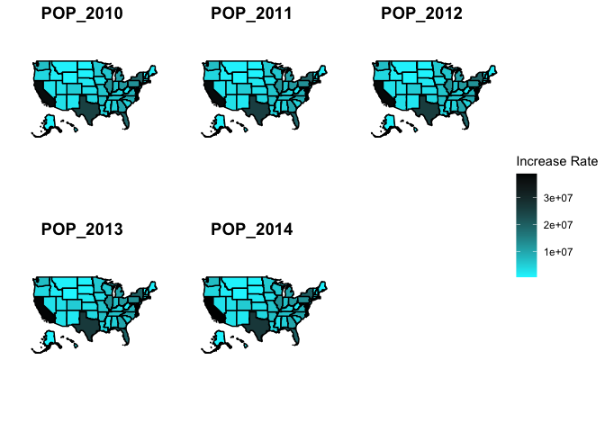
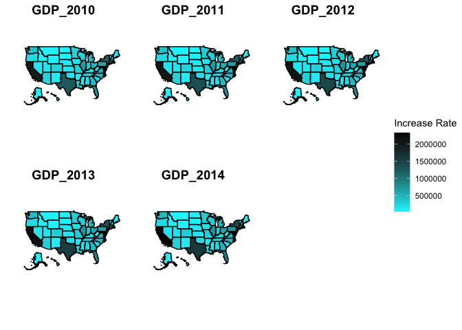
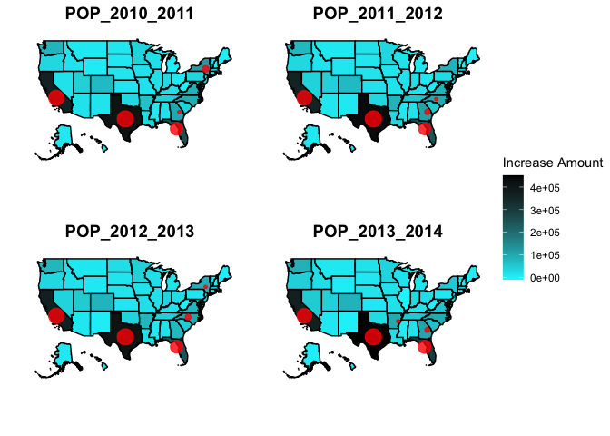
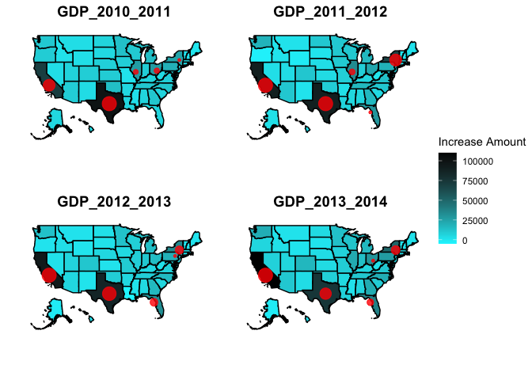
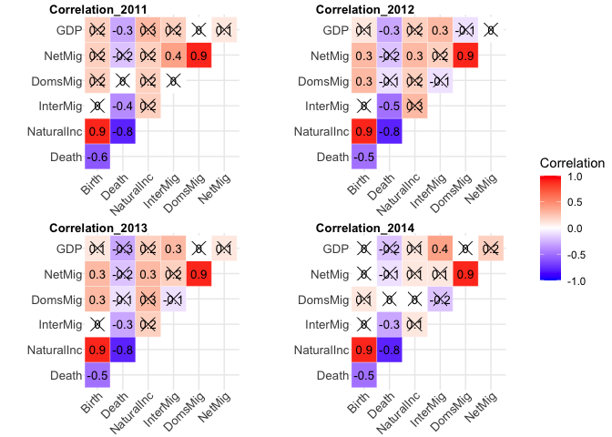
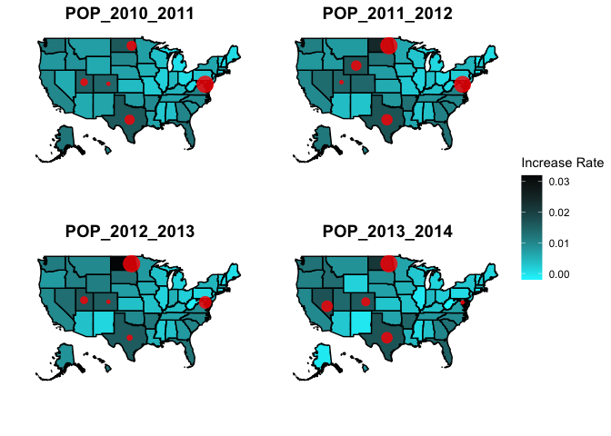
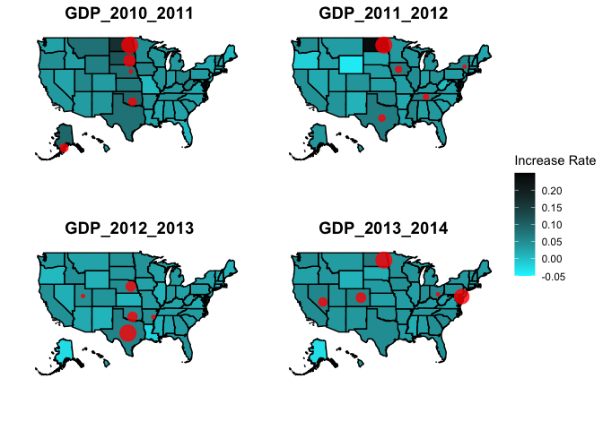
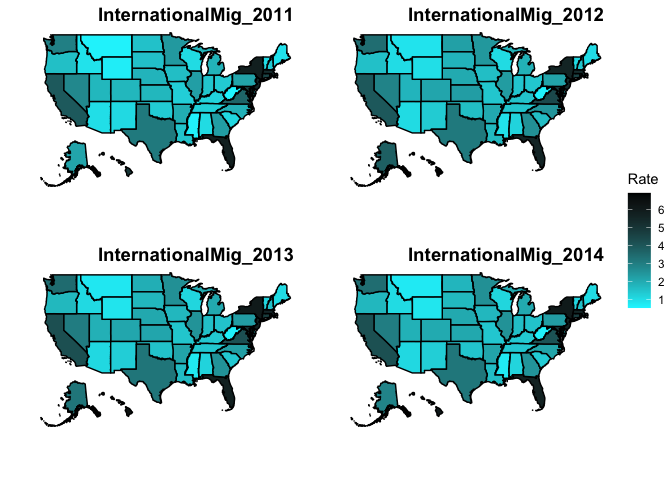

Eda\_Final\_Peter
================
Xinyu Gao

## R Markdown

``` r
library(tidyverse)
```

    ## ── Attaching packages ─────────────────────────────────────── tidyverse 1.3.1 ──

    ## ✓ ggplot2 3.3.5     ✓ purrr   0.3.4
    ## ✓ tibble  3.1.5     ✓ dplyr   1.0.7
    ## ✓ tidyr   1.1.4     ✓ stringr 1.4.0
    ## ✓ readr   2.0.1     ✓ forcats 0.5.1

    ## ── Conflicts ────────────────────────────────────────── tidyverse_conflicts() ──
    ## x dplyr::filter() masks stats::filter()
    ## x dplyr::lag()    masks stats::lag()

``` r
library(ggplot2)
library(mapdata)
```

    ## Loading required package: maps

    ## 
    ## Attaching package: 'maps'

    ## The following object is masked from 'package:purrr':
    ## 
    ##     map

``` r
library(ggpubr)
#install.packages('devtools')
library(devtools)
```

    ## Loading required package: usethis

``` r
#install_github(“UrbanInstitute/urbnmapr”)
library(urbnmapr)
library(ggcorrplot)
```

# load data

``` r
data <- read.csv("Energy Census and Economic Data US 2010-2014.csv")
states <- urbnmapr::states

states <- states %>%
  select(long,lat,group,state_name) %>%
  rename(region = state_name)
```

# check the dataset situation

``` r
# find the missing value
check_missing <- function(data)
{
  name <- c()
  num <- c()
  row <- c()
  var_names <- names(data)
  
  for (i in 1:dim(data)[2]){
    temp <- data %>% `[[` (i)
    if (!all(!(is.na(temp)))){
      name <- c(name,var_names[i])
      count <- 0
      row_record <- c()
      for (t in 1:length(temp)){
         if (is.na(temp[t])){
           count <- count + 1
           row_record <- c(row_record,t)
         }
      }
      num <- c(num,count)
      row <- c(row, row_record)
    }
  }
  data.frame(name,num,row)
}
missing_infor <- check_missing(data)
missing_infor
```

    ##               name num row
    ## 1           Region   1  52
    ## 2         Division   1  52
    ## 3            Coast   1  52
    ## 4      Great.Lakes   1  52
    ## 5 RDOMESTICMIG2011   1  52
    ## 6 RDOMESTICMIG2012   1  52
    ## 7 RDOMESTICMIG2013   1  52
    ## 8 RDOMESTICMIG2014   1  52

``` r
POP <- data[1:51,]%>%
  select(State,POPESTIMATE2010,POPESTIMATE2011,POPESTIMATE2012,POPESTIMATE2013,POPESTIMATE2014)
POP <- POP %>%
  rename(region = State)

POP <- left_join(POP,states)
```

    ## Joining, by = "region"

``` r
POP_2010 <-ggplot(data = POP) + 
  geom_polygon(aes(x = long, y = lat, fill = POPESTIMATE2010,group=group), color = "black") +
  coord_fixed(1.3) + 
  scale_fill_gradient(low="turquoise1",high="black",limits = c(564358,38805000))+
  xlab("")+
  ylab("")+
  theme_minimal()+
  theme(
   axis.text.x = element_blank(),
   axis.text.y = element_blank(),
   axis.ticks = element_blank(),
   panel.grid.major = element_blank(), 
   panel.grid.minor = element_blank())+ labs(fill='Increase Rate') 


POP_2011 <-ggplot(data = POP) + 
  geom_polygon(aes(x = long, y = lat, fill = POPESTIMATE2011, group = group), color = "black") + 
  coord_fixed(1.3) + 
  scale_fill_gradient(low="turquoise1",high="black",limits = c(564358,38805000))+
  xlab("")+
  ylab("")+
  theme_minimal()+ 
  theme(
  axis.text.x = element_blank(),
  axis.text.y = element_blank(),
  axis.ticks = element_blank(),
  panel.grid.major = element_blank(), 
  panel.grid.minor = element_blank())+ labs(fill='2011-2012 GDP (MUSD)')

POP_2012 <-ggplot(data = POP) + 
  geom_polygon(aes(x = long, y = lat, fill = POPESTIMATE2012, group = group), color = "black") + 
  coord_fixed(1.3) + 
  scale_fill_gradient(low="turquoise1",high="black",limits = c(564358,38805000))+
  xlab("")+
  ylab("")+
  theme_minimal()+
  theme(
  axis.text.x = element_blank(),
  axis.text.y = element_blank(),
  axis.ticks = element_blank(),
  panel.grid.major = element_blank(), 
  panel.grid.minor = element_blank())+ labs(fill='2012-2013 GDP (MUSD)')

POP_2013 <-ggplot(data = POP) + 
  geom_polygon(aes(x = long, y = lat, fill = POPESTIMATE2013, group = group), color = "black") + 
  coord_fixed(1.3) + 
  scale_fill_gradient(low="turquoise1",high="black",limits = c(564358,38805000))+
  xlab("")+
  ylab("")+
  theme_minimal()+
  theme(
  axis.text.x = element_blank(),
  axis.text.y = element_blank(),
  axis.ticks = element_blank(),
  panel.grid.major = element_blank(), 
  panel.grid.minor = element_blank())+ labs(fill='2013-2014 GDP (MUSD)') 

POP_2014 <-ggplot(data = POP) + 
  geom_polygon(aes(x = long, y = lat, fill = POPESTIMATE2014, group = group), color = "black") + 
  coord_fixed(1.3) + 
  scale_fill_gradient(low="turquoise1",high="black",limits = c(564358,38805000))+
  xlab("")+
  ylab("")+
  theme_minimal()+
  theme(
  axis.text.x = element_blank(),
  axis.text.y = element_blank(),
  axis.ticks = element_blank(),
  panel.grid.major = element_blank(), 
  panel.grid.minor = element_blank())+ labs(fill='2013-2014 GDP (MUSD)')

 ggarrange( POP_2010, POP_2011,POP_2012, POP_2013,POP_2014,
            labels = c("POP_2010", "POP_2011", "POP_2012","POP_2013","POP_2014"),
            ncol = 3, nrow = 2,
            common.legend = TRUE,
            legend = "right")
```

<!-- -->

# GDP situation 2010-2014

``` r
GDP<- data[1:51,]%>%
  select(State,GDP2010,GDP2011,GDP2012,GDP2013,GDP2014)

GDP <- GDP %>%
  rename(region = State)
GDP <- left_join(GDP,states)
```

    ## Joining, by = "region"

``` r
GDP_2010 <-ggplot(data = GDP) + 
  geom_polygon(aes(x = long, y = lat, fill = GDP2010,group=group), color = "black") +
  coord_fixed(1.3) + 
  scale_fill_gradient(low="turquoise1",high="black",limits = c(26000,2325000))+
  xlab("")+
  ylab("")+
  theme_minimal()+
  theme(
   axis.text.x = element_blank(),
   axis.text.y = element_blank(),
   axis.ticks = element_blank(),
   panel.grid.major = element_blank(), 
   panel.grid.minor = element_blank())+ labs(fill='Increase Rate') 


GDP_2011 <-ggplot(data = GDP) + 
  geom_polygon(aes(x = long, y = lat, fill = GDP2011, group = group), color = "black") + 
  coord_fixed(1.3) + 
  scale_fill_gradient(low="turquoise1",high="black",limits = c(26000,2325000))+
  xlab("")+
  ylab("")+
  theme_minimal()+ 
  theme(
  axis.text.x = element_blank(),
  axis.text.y = element_blank(),
  axis.ticks = element_blank(),
  panel.grid.major = element_blank(), 
  panel.grid.minor = element_blank())+ labs(fill='2011-2012 GDP (MUSD)')

GDP_2012 <-ggplot(data = GDP) + 
  geom_polygon(aes(x = long, y = lat, fill = GDP2012, group = group), color = "black") + 
  coord_fixed(1.3) + 
  scale_fill_gradient(low="turquoise1",high="black",limits = c(26000,2325000))+
  xlab("")+
  ylab("")+
  theme_minimal()+
  theme(
  axis.text.x = element_blank(),
  axis.text.y = element_blank(),
  axis.ticks = element_blank(),
  panel.grid.major = element_blank(), 
  panel.grid.minor = element_blank())+ labs(fill='2012-2013 GDP (MUSD)')

GDP_2013 <-ggplot(data = GDP) + 
  geom_polygon(aes(x = long, y = lat, fill = GDP2013, group = group), color = "black") + 
  coord_fixed(1.3) + 
  scale_fill_gradient(low="turquoise1",high="black",limits = c(26000,2325000))+
  xlab("")+
  ylab("")+
  theme_minimal()+
  theme(
  axis.text.x = element_blank(),
  axis.text.y = element_blank(),
  axis.ticks = element_blank(),
  panel.grid.major = element_blank(), 
  panel.grid.minor = element_blank())+ labs(fill='2013-2014 GDP (MUSD)') 

GDP_2014 <-ggplot(data = GDP) + 
  geom_polygon(aes(x = long, y = lat, fill = GDP2014, group = group), color = "black") + 
  coord_fixed(1.3) + 
  scale_fill_gradient(low="turquoise1",high="black",limits = c(26000,2325000))+
  xlab("")+
  ylab("")+
  theme_minimal()+
  theme(
  axis.text.x = element_blank(),
  axis.text.y = element_blank(),
  axis.ticks = element_blank(),
  panel.grid.major = element_blank(), 
  panel.grid.minor = element_blank())+ labs(fill='2013-2014 GDP (MUSD)')

 ggarrange( GDP_2010, GDP_2011,GDP_2012, GDP_2013,GDP_2014,
            labels = c("GDP_2010", "GDP_2011", "GDP_2012","GDP_2013","GDP_2014"),
            ncol = 3, nrow = 2,
            common.legend = TRUE,
            legend = "right")
```

<!-- -->

# POP change

``` r
POP_change <- data[1:51,]%>%
  select(State,POPESTIMATE2010,POPESTIMATE2011,POPESTIMATE2012,POPESTIMATE2013,POPESTIMATE2014) %>%
  mutate(POP_2010_2011 = (POPESTIMATE2011-POPESTIMATE2010),
         POP_2011_2012 = (POPESTIMATE2012-POPESTIMATE2011),
         POP_2012_2013 = (POPESTIMATE2013-POPESTIMATE2012),
         POP_2013_2014 = (POPESTIMATE2014-POPESTIMATE2013)) %>%
  select(-(POPESTIMATE2010:POPESTIMATE2014))

POP_change <- rename(POP_change,region = State) 
POP_change$region=as.character(POP_change$region)
# states <- states %>%
#   select(long,lat,group,state_name) %>%
#   rename(region = state_name)

pop_states <- left_join(POP_change,states)
```

    ## Joining, by = "region"

``` r
state_center <- pop_states %>%
  group_by(region) %>%
  summarise(long = mean(long,na.rm=TRUE), lat = mean(lat,na.rm=TRUE))

Top_2010_2011 <- POP_change %>%
  arrange(desc(POP_2010_2011)) %>%
  slice(1:5) %>%
  select(region,POP_2010_2011)%>%
  left_join(state_center)
```

    ## Joining, by = "region"

``` r
Top_2011_2012 <- POP_change %>%
  arrange(desc(POP_2011_2012)) %>%
  slice(1:5) %>%
  select(region,POP_2011_2012)%>%
  left_join(state_center)
```

    ## Joining, by = "region"

``` r
Top_2012_2013 <- POP_change %>%
  arrange(desc(POP_2012_2013)) %>%
  slice(1:5) %>%
  select(region,POP_2012_2013)%>%
  left_join(state_center)
```

    ## Joining, by = "region"

``` r
Top_2013_2014 <- POP_change %>%
  arrange(desc(POP_2013_2014)) %>%
  slice(1:5) %>%
  select(region,POP_2013_2014)%>%
  left_join(state_center)
```

    ## Joining, by = "region"

``` r
POP_2010_2011 <-ggplot(data = pop_states) + 
  geom_polygon(aes(x = long, y = lat, fill = POP_2010_2011,group=group), color = "black") +
  coord_fixed(1.3) + 
  scale_fill_gradient(low="turquoise1",high="black",limits = c(-10000,452000))+
  xlab("")+
  ylab("")+
  theme_minimal()+
  theme(
   axis.text.x = element_blank(),
   axis.text.y = element_blank(),
   axis.ticks = element_blank(),
   panel.grid.major = element_blank(), 
   panel.grid.minor = element_blank())+ labs(fill='Increase Amount') + 
  geom_point(data = Top_2010_2011,aes(x=long,y=lat, size=POP_2010_2011),color="red",alpha=0.8) + guides(size="none")

# +  scale_size(name="Increase Rate")


POP_2011_2012 <-ggplot(data = pop_states) + 
  geom_polygon(aes(x = long, y = lat, fill = POP_2011_2012, group = group), color = "black") + 
  coord_fixed(1.3) + 
  scale_fill_gradient(low="turquoise1",high="black",limits = c(-10000,452000))+
  xlab("")+
  ylab("")+
  theme_minimal()+ 
  theme(
  axis.text.x = element_blank(),
  axis.text.y = element_blank(),
  axis.ticks = element_blank(),
  panel.grid.major = element_blank(), 
  panel.grid.minor = element_blank())+ labs(fill='2011-2012 GDP (MUSD)')+
  geom_point(data = Top_2011_2012,aes(x=long,y=lat, size=POP_2011_2012),color="red",alpha=0.8) + guides(size="none")

POP_2012_2013 <-ggplot(data = pop_states) + 
  geom_polygon(aes(x = long, y = lat, fill = POP_2012_2013, group = group), color = "black") + 
  coord_fixed(1.3) + 
  scale_fill_gradient(low="turquoise1",high="black",limits = c(-10000,452000))+
  xlab("")+
  ylab("")+
  theme_minimal()+
  theme(
  axis.text.x = element_blank(),
  axis.text.y = element_blank(),
  axis.ticks = element_blank(),
  panel.grid.major = element_blank(), 
  panel.grid.minor = element_blank())+ labs(fill='2012-2013 GDP (MUSD)')+
  geom_point(data = Top_2012_2013,aes(x=long,y=lat, size=POP_2012_2013),color="red",alpha=0.8)+ guides(size="none")

POP_2013_2014 <-ggplot(data = pop_states) + 
  geom_polygon(aes(x = long, y = lat, fill = POP_2013_2014, group = group), color = "black") + 
  coord_fixed(1.3) + 
  scale_fill_gradient(low="turquoise1",high="black",limits = c(-10000,452000))+
  xlab("")+
  ylab("")+
  theme_minimal()+
  theme(
  axis.text.x = element_blank(),
  axis.text.y = element_blank(),
  axis.ticks = element_blank(),
  panel.grid.major = element_blank(), 
  panel.grid.minor = element_blank())+ labs(fill='2013-2014 GDP (MUSD)') +
  geom_point(data = Top_2013_2014,aes(x=long,y=lat, size=POP_2013_2014),color="red",alpha=0.8)+ guides(size="none")

 ggarrange( POP_2010_2011, POP_2011_2012,POP_2012_2013, POP_2013_2014,
            labels = c("POP_2010_2011", "POP_2011_2012", "POP_2012_2013","POP_2013_2014"),
            ncol = 2, nrow = 2,
            common.legend = TRUE,
            legend = "right")
```

<!-- -->

# GDP change

``` r
GDP_change <- data[1:51,]%>%
  select(State,GDP2010,GDP2011,GDP2012,GDP2013,GDP2014) %>%
  mutate(GDP_2010_2011 = (GDP2011-GDP2010),
         GDP_2011_2012 = (GDP2012-GDP2011),
         GDP_2012_2013 = (GDP2013-GDP2012),
         GDP_2013_2014 = (GDP2014-GDP2013)) %>%
  select(-(GDP2010:GDP2014))

GDP_change <- rename(GDP_change,region = State) 
GDP_change$region=as.character(GDP_change$region)

GDP_states <- left_join(GDP_change,states)
```

    ## Joining, by = "region"

``` r
state_center <- pop_states %>%
  group_by(region) %>%
  summarise(long = mean(long,na.rm=TRUE), lat = mean(lat,na.rm=TRUE ))

Top_2010_2011_GDP <- GDP_change %>%
  arrange(desc(GDP_2010_2011)) %>%
  slice(1:5) %>%
  select(region,GDP_2010_2011)%>%
  left_join(state_center)
```

    ## Joining, by = "region"

``` r
Top_2011_2012_GDP <- GDP_change %>%
  arrange(desc(GDP_2011_2012)) %>%
  slice(1:5) %>%
  select(region,GDP_2011_2012)%>%
  left_join(state_center)
```

    ## Joining, by = "region"

``` r
Top_2012_2013_GDP <- GDP_change %>%
  arrange(desc(GDP_2012_2013)) %>%
  slice(1:5) %>%
  select(region,GDP_2012_2013)%>%
  left_join(state_center)
```

    ## Joining, by = "region"

``` r
Top_2013_2014_GDP <- GDP_change %>%
  arrange(desc(GDP_2013_2014)) %>%
  slice(1:5) %>%
  select(region,GDP_2013_2014)%>%
  left_join(state_center)
```

    ## Joining, by = "region"

``` r
GDP_2010_2011 <-ggplot(data = GDP_states) + 
  geom_polygon(aes(x = long, y = lat, fill = GDP_2010_2011,group=group), color = "black") +
  coord_fixed(1.3) + 
  scale_fill_gradient(low="turquoise1",high="black",limits = c(-5005,110000))+
  xlab("")+
  ylab("")+
  theme_minimal()+
  theme(
   axis.text.x = element_blank(),
   axis.text.y = element_blank(),
   axis.ticks = element_blank(),
   panel.grid.major = element_blank(), 
   panel.grid.minor = element_blank())+ labs(fill='Increase Amount') +
  geom_point(data = Top_2010_2011_GDP,aes(x=long,y=lat, size=GDP_2010_2011),color="red",alpha=0.8)  + guides(size="none")


GDP_2011_2012 <-ggplot(data = GDP_states) + 
  geom_polygon(aes(x = long, y = lat, fill = GDP_2011_2012, group = group), color = "black") + 
  coord_fixed(1.3) + 
  scale_fill_gradient(low="turquoise1",high="black",limits = c(-5005,110000))+
  xlab("")+
  ylab("")+
  theme_minimal()+ 
  theme(
  axis.text.x = element_blank(),
  axis.text.y = element_blank(),
  axis.ticks = element_blank(),
  panel.grid.major = element_blank(), 
  panel.grid.minor = element_blank())+ labs(fill='2011-2012 GDP (MUSD)')+
  geom_point(data = Top_2011_2012_GDP,aes(x=long,y=lat, size=GDP_2011_2012),color="red",alpha=0.8) + guides(size="none")

GDP_2012_2013 <-ggplot(data = GDP_states) + 
  geom_polygon(aes(x = long, y = lat, fill = GDP_2012_2013, group = group), color = "black") + 
  coord_fixed(1.3) + 
  scale_fill_gradient(low="turquoise1",high="black",limits = c(-5005,110000))+
  xlab("")+
  ylab("")+
  theme_minimal()+
  theme(
  axis.text.x = element_blank(),
  axis.text.y = element_blank(),
  axis.ticks = element_blank(),
  panel.grid.major = element_blank(), 
  panel.grid.minor = element_blank())+ labs(fill='2012-2013 GDP (MUSD)')+
  geom_point(data = Top_2012_2013_GDP,aes(x=long,y=lat, size=GDP_2012_2013),color="red",alpha=0.8) + guides(size="none")

GDP_2013_2014 <-ggplot(data = GDP_states) + 
  geom_polygon(aes(x = long, y = lat, fill = GDP_2013_2014, group = group), color = "black") + 
  coord_fixed(1.3) + 
  scale_fill_gradient(low="turquoise1",high="black",limits = c(-5005,110000))+
  xlab("")+
  ylab("")+
  theme_minimal()+
  theme(
  axis.text.x = element_blank(),
  axis.text.y = element_blank(),
  axis.ticks = element_blank(),
  panel.grid.major = element_blank(), 
  panel.grid.minor = element_blank())+ labs(fill='2013-2014 GDP (MUSD)') +
  geom_point(data = Top_2013_2014_GDP,aes(x=long,y=lat, size=GDP_2013_2014),color="red",alpha=0.8) + guides(size="none")

 ggarrange( GDP_2010_2011, GDP_2011_2012,GDP_2012_2013, GDP_2013_2014,
            labels = c("GDP_2010_2011", "GDP_2011_2012", "GDP_2012_2013","GDP_2013_2014"),
            ncol = 2, nrow = 2,
            common.legend = TRUE,
            legend = "right")
```

<!-- -->

# Correlation between factors influcing population and GDP

``` r
POP_GDP_infor <- data[1:51,]%>%
  select(RBIRTH2011:RNETMIG2014,GDP2010,GDP2011,GDP2012,GDP2013,GDP2014) %>%
  mutate(GDP2010_2011 = GDP2011-GDP2010,
         GDP2011_2012 = GDP2012-GDP2011,
         GDP2012_2013 = GDP2013-GDP2012,
         GDP2013_2014 = GDP2014-GDP2013) %>%
  select(-(GDP2010:GDP2014))

POP_GDP_infor_2011 <- POP_GDP_infor %>%
  select(RBIRTH2011,RDEATH2011,RNATURALINC2011,RINTERNATIONALMIG2011,RDOMESTICMIG2011,RNETMIG2011,GDP2010_2011)
colnames(POP_GDP_infor_2011) <- c("Birth", "Death", "NaturalInc", "InterMig", "DomsMig","NetMig","GDP")
correlation_matrix_2011 <- round(cor(POP_GDP_infor_2011),1)
corrp.mat_2011 <- cor_pmat(POP_GDP_infor_2011)
cor_2011 <- ggcorrplot(correlation_matrix_2011, 
           #hc.order =TRUE,
           outline.color ="white",
           type = "upper",
           legend.title = "Correlation",
           lab = TRUE,
           lab_size = 3.5,
           p.mat = corrp.mat_2011) +
           theme(
             axis.text.x=element_text(size=10, angle=45, vjust=1, hjust=1,margin=margin(-3,0,0,0)),
             axis.text.y=element_text(size=10, margin=margin(0,-3,0,0)),
             plot.margin=margin(t=12))


POP_GDP_infor_2012 <- POP_GDP_infor %>%
  select(RBIRTH2012,RDEATH2012,RNATURALINC2012,RINTERNATIONALMIG2012,RDOMESTICMIG2012,RNETMIG2012,GDP2011_2012)
colnames(POP_GDP_infor_2012) <- c("Birth", "Death", "NaturalInc", "InterMig", "DomsMig","NetMig","GDP")
correlation_matrix_2012 <- round(cor(POP_GDP_infor_2012),1)
corrp.mat_2012 <- cor_pmat(POP_GDP_infor_2012)
cor_2012 <- ggcorrplot(correlation_matrix_2012, 
           #hc.order =TRUE,
           outline.color ="white",
           type = "upper",
           legend.title = "Correlation",
           lab = TRUE,
           lab_size = 3.5,
           p.mat = corrp.mat_2012) + 
           theme(
             axis.text.x=element_text(size=10, angle=45, vjust=1, hjust=1,margin=margin(-3,0,0,0)),
             axis.text.y=element_text(size=10, margin=margin(0,-3,0,0)),
             plot.margin=margin(t=12))


POP_GDP_infor_2013 <- POP_GDP_infor %>%
  select(RBIRTH2013,RDEATH2013,RNATURALINC2013,RINTERNATIONALMIG2013,RDOMESTICMIG2013,RNETMIG2013,GDP2012_2013)
colnames(POP_GDP_infor_2013) <- c("Birth", "Death", "NaturalInc", "InterMig", "DomsMig","NetMig","GDP")
correlation_matrix_2013 <- round(cor(POP_GDP_infor_2013),1)
corrp.mat_2013 <- cor_pmat(POP_GDP_infor_2013)
cor_2013 <- ggcorrplot(correlation_matrix_2013, 
           #hc.order =TRUE,
           outline.color ="white",
           type = "upper",
           legend.title = "Correlation",
           lab = TRUE,
           lab_size = 3.5,
           p.mat = corrp.mat_2013)+
           theme(
             axis.text.x=element_text(size=10, angle=45, vjust=1, hjust=1,margin=margin(-3,0,0,0)),
             axis.text.y=element_text(size=10, margin=margin(0,-3,0,0)),
             plot.margin=margin(t=12))

POP_GDP_infor_2014 <- POP_GDP_infor %>%
  select(RBIRTH2014,RDEATH2014,RNATURALINC2014,RINTERNATIONALMIG2014,RDOMESTICMIG2014,RNETMIG2014,GDP2013_2014)
colnames(POP_GDP_infor_2014) <- c("Birth", "Death", "NaturalInc", "InterMig", "DomsMig","NetMig","GDP")

correlation_matrix_2014 <- round(cor(POP_GDP_infor_2014),1)
corrp.mat_2014 <- cor_pmat(POP_GDP_infor_2014)
cor_2014 <- ggcorrplot(correlation_matrix_2014,
           #hc.order =TRUE,
           outline.color ="white",
           type = "upper",
           legend.title = "Correlation",
           lab = TRUE,
           lab_size = 3.5,
           p.mat = corrp.mat_2014) +
           theme(
             axis.text.x=element_text(size=10, angle=45, vjust=1, hjust=1,margin=margin(-3,0,0,0)),
             axis.text.y=element_text(size=10, margin=margin(0,-3,0,0)),
             plot.margin=margin(t=12))

ggarrange( cor_2011, cor_2012,cor_2013, cor_2014,
            labels = c("Correlation_2011", "Correlation_2012", "Correlation_2013","Correlation_2014"),
            ncol = 2, nrow = 2,
            common.legend = TRUE,
            legend = "right",
            font.label = list(size = 10))
```

<!-- -->

# Population increase rate

``` r
POP_change <- data[1:51,]%>%
  select(State,POPESTIMATE2010,POPESTIMATE2011,POPESTIMATE2012,POPESTIMATE2013,POPESTIMATE2014) %>%
  mutate(POP_2010_2011 = (POPESTIMATE2011-POPESTIMATE2010)/POPESTIMATE2010,
         POP_2011_2012 = (POPESTIMATE2012-POPESTIMATE2011)/POPESTIMATE2011,
         POP_2012_2013 = (POPESTIMATE2013-POPESTIMATE2012)/POPESTIMATE2012,
         POP_2013_2014 = (POPESTIMATE2014-POPESTIMATE2013)/POPESTIMATE2013) %>%
  select(-(POPESTIMATE2010:POPESTIMATE2014))

POP_change <- rename(POP_change,region = State) 
POP_change$region=as.character(POP_change$region)
# states <- states %>%
#   select(long,lat,group,state_name) %>%
#   rename(region = state_name)

pop_states <- left_join(POP_change,states)
```

    ## Joining, by = "region"

``` r
state_center <- pop_states %>%
  group_by(region) %>%
  summarise(long = mean(long,na.rm=TRUE), lat = mean(lat,na.rm=TRUE))

Top_2010_2011 <- POP_change %>%
  arrange(desc(POP_2010_2011)) %>%
  slice(1:5) %>%
  select(region,POP_2010_2011)%>%
  left_join(state_center)
```

    ## Joining, by = "region"

``` r
Top_2011_2012 <- POP_change %>%
  arrange(desc(POP_2011_2012)) %>%
  slice(1:5) %>%
  select(region,POP_2011_2012)%>%
  left_join(state_center)
```

    ## Joining, by = "region"

``` r
Top_2012_2013 <- POP_change %>%
  arrange(desc(POP_2012_2013)) %>%
  slice(1:5) %>%
  select(region,POP_2012_2013)%>%
  left_join(state_center)
```

    ## Joining, by = "region"

``` r
Top_2013_2014 <- POP_change %>%
  arrange(desc(POP_2013_2014)) %>%
  slice(1:5) %>%
  select(region,POP_2013_2014)%>%
  left_join(state_center)
```

    ## Joining, by = "region"

``` r
POP_2010_2011 <-ggplot(data = pop_states) + 
  geom_polygon(aes(x = long, y = lat, fill = POP_2010_2011,group=group), color = "black") +
  coord_fixed(1.3) + 
  scale_fill_gradient(low="turquoise1",high="black",limits = c(-0.002,0.032))+
  xlab("")+
  ylab("")+
  theme_minimal()+
  theme(
   axis.text.x = element_blank(),
   axis.text.y = element_blank(),
   axis.ticks = element_blank(),
   panel.grid.major = element_blank(), 
   panel.grid.minor = element_blank())+ labs(fill='Increase Rate') +
  geom_point(data = Top_2010_2011,aes(x=long,y=lat, size=POP_2010_2011),color="red",alpha=0.8) + guides(size="none")


POP_2011_2012 <-ggplot(data = pop_states) + 
  geom_polygon(aes(x = long, y = lat, fill = POP_2011_2012, group = group), color = "black") + 
  coord_fixed(1.3) + 
  scale_fill_gradient(low="turquoise1",high="black",limits = c(-0.002,0.032))+
  xlab("")+
  ylab("")+
  theme_minimal()+ 
  theme(
  axis.text.x = element_blank(),
  axis.text.y = element_blank(),
  axis.ticks = element_blank(),
  panel.grid.major = element_blank(), 
  panel.grid.minor = element_blank())+ labs(fill='2011-2012 GDP (MUSD)')+
  geom_point(data = Top_2011_2012,aes(x=long,y=lat, size=POP_2011_2012),color="red",alpha=0.8) + guides(size="none")

POP_2012_2013 <-ggplot(data = pop_states) + 
  geom_polygon(aes(x = long, y = lat, fill = POP_2012_2013, group = group), color = "black") + 
  coord_fixed(1.3) + 
  scale_fill_gradient(low="turquoise1",high="black",limits = c(-0.002,0.032))+
  xlab("")+
  ylab("")+
  theme_minimal()+
  theme(
  axis.text.x = element_blank(),
  axis.text.y = element_blank(),
  axis.ticks = element_blank(),
  panel.grid.major = element_blank(), 
  panel.grid.minor = element_blank())+ labs(fill='2012-2013 GDP (MUSD)')+
  geom_point(data = Top_2012_2013,aes(x=long,y=lat, size=POP_2012_2013),color="red",alpha=0.8) + guides(size="none")

POP_2013_2014 <-ggplot(data = pop_states) + 
  geom_polygon(aes(x = long, y = lat, fill = POP_2013_2014, group = group), color = "black") + 
  coord_fixed(1.3) + 
  scale_fill_gradient(low="turquoise1",high="black",limits = c(-0.002,0.032))+
  xlab("")+
  ylab("")+
  theme_minimal()+
  theme(
  axis.text.x = element_blank(),
  axis.text.y = element_blank(),
  axis.ticks = element_blank(),
  panel.grid.major = element_blank(), 
  panel.grid.minor = element_blank())+ labs(fill='2013-2014 GDP (MUSD)') +
  geom_point(data = Top_2013_2014,aes(x=long,y=lat, size=POP_2013_2014),color="red",alpha=0.8)+ guides(size="none")

 ggarrange( POP_2010_2011, POP_2011_2012,POP_2012_2013, POP_2013_2014,
            labels = c("POP_2010_2011", "POP_2011_2012", "POP_2012_2013","POP_2013_2014"),
            ncol = 2, nrow = 2,
            common.legend = TRUE,
            legend = "right")
```

<!-- -->

# GDP increase rate

``` r
GDP_change <- data[1:51,]%>%
  select(State,GDP2010,GDP2011,GDP2012,GDP2013,GDP2014) %>%
  mutate(GDP_2010_2011 = (GDP2011-GDP2010)/GDP2010,
         GDP_2011_2012 = (GDP2012-GDP2011)/GDP2011,
         GDP_2012_2013 = (GDP2013-GDP2012)/GDP2012,
         GDP_2013_2014 = (GDP2014-GDP2013)/GDP2013) %>%
  select(-(GDP2010:GDP2014))

GDP_change <- rename(GDP_change,region = State) 
GDP_change$region=as.character(GDP_change$region)


GDP_states <- left_join(GDP_change,states)
```

    ## Joining, by = "region"

``` r
state_center <- pop_states %>%
  group_by(region) %>%
  summarise(long = mean(long,na.rm=TRUE), lat = mean(lat,na.rm=TRUE ))

Top_2010_2011_GDP <- GDP_change %>%
  arrange(desc(GDP_2010_2011)) %>%
  slice(1:5) %>%
  select(region,GDP_2010_2011)%>%
  left_join(state_center)
```

    ## Joining, by = "region"

``` r
Top_2011_2012_GDP <- GDP_change %>%
  arrange(desc(GDP_2011_2012)) %>%
  slice(1:5) %>%
  select(region,GDP_2011_2012)%>%
  left_join(state_center)
```

    ## Joining, by = "region"

``` r
Top_2012_2013_GDP <- GDP_change %>%
  arrange(desc(GDP_2012_2013)) %>%
  slice(1:5) %>%
  select(region,GDP_2012_2013)%>%
  left_join(state_center)
```

    ## Joining, by = "region"

``` r
Top_2013_2014_GDP <- GDP_change %>%
  arrange(desc(GDP_2013_2014)) %>%
  slice(1:5) %>%
  select(region,GDP_2013_2014)%>%
  left_join(state_center)
```

    ## Joining, by = "region"

``` r
GDP_2010_2011 <-ggplot(data = GDP_states) + 
  geom_polygon(aes(x = long, y = lat, fill = GDP_2010_2011,group=group), color = "black") +
  coord_fixed(1.3) + 
  scale_fill_gradient(low="turquoise1",high="black",limits = c(-0.05,0.25))+
  xlab("")+
  ylab("")+
  theme_minimal()+
  theme(
   axis.text.x = element_blank(),
   axis.text.y = element_blank(),
   axis.ticks = element_blank(),
   panel.grid.major = element_blank(), 
   panel.grid.minor = element_blank())+ labs(fill='Increase Rate') +
  geom_point(data = Top_2010_2011_GDP,aes(x=long,y=lat, size=GDP_2010_2011),color="red",alpha=0.8) + guides(size="none")

GDP_2011_2012 <-ggplot(data = GDP_states) + 
  geom_polygon(aes(x = long, y = lat, fill = GDP_2011_2012, group = group), color = "black") + 
  coord_fixed(1.3) + 
  scale_fill_gradient(low="turquoise1",high="black",limits = c(-0.05,0.25))+
  xlab("")+
  ylab("")+
  theme_minimal()+ 
  theme(
  axis.text.x = element_blank(),
  axis.text.y = element_blank(),
  axis.ticks = element_blank(),
  panel.grid.major = element_blank(), 
  panel.grid.minor = element_blank())+ labs(fill='2011-2012 GDP (MUSD)')+
  geom_point(data = Top_2011_2012_GDP,aes(x=long,y=lat, size=GDP_2011_2012),color="red",alpha=0.8)+ guides(size="none")

GDP_2012_2013 <-ggplot(data = GDP_states) + 
  geom_polygon(aes(x = long, y = lat, fill = GDP_2012_2013, group = group), color = "black") + 
  coord_fixed(1.3) + 
  scale_fill_gradient(low="turquoise1",high="black",limits = c(-0.05,0.25))+
  xlab("")+
  ylab("")+
  theme_minimal()+
  theme(
  axis.text.x = element_blank(),
  axis.text.y = element_blank(),
  axis.ticks = element_blank(),
  panel.grid.major = element_blank(), 
  panel.grid.minor = element_blank())+ labs(fill='2012-2013 GDP (MUSD)')+
  geom_point(data = Top_2012_2013_GDP,aes(x=long,y=lat, size=GDP_2012_2013),color="red",alpha=0.8)+ guides(size="none")

GDP_2013_2014 <-ggplot(data = GDP_states) + 
  geom_polygon(aes(x = long, y = lat, fill = GDP_2013_2014, group = group), color = "black") + 
  coord_fixed(1.3) + 
  scale_fill_gradient(low="turquoise1",high="black",limits = c(-0.05,0.25))+
  xlab("")+
  ylab("")+
  theme_minimal()+
  theme(
  axis.text.x = element_blank(),
  axis.text.y = element_blank(),
  axis.ticks = element_blank(),
  panel.grid.major = element_blank(), 
  panel.grid.minor = element_blank())+ labs(fill='2013-2014 GDP (MUSD)') +
  geom_point(data = Top_2013_2014_GDP,aes(x=long,y=lat, size=GDP_2013_2014),color="red",alpha=0.8)+ guides(size="none")

 ggarrange( GDP_2010_2011, GDP_2011_2012,GDP_2012_2013, GDP_2013_2014,
            labels = c("GDP_2010_2011", "GDP_2011_2012", "GDP_2012_2013","GDP_2013_2014"),
            ncol = 2, nrow = 2,
            common.legend = TRUE,
            legend = "right")
```

<!-- -->

``` r
InterMig <- data[1:51,]%>%
  select(State,RINTERNATIONALMIG2011,RINTERNATIONALMIG2012,RINTERNATIONALMIG2013,RINTERNATIONALMIG2014) 

InterMig <- rename(InterMig,region = State) 
InterMig$region=as.character(InterMig$region)
InterMig_states <- left_join(InterMig,states)
```

    ## Joining, by = "region"

``` r
InterMig_2011 <-ggplot(data = InterMig_states) + 
  geom_polygon(aes(x = long, y = lat, fill = RINTERNATIONALMIG2011,group=group), color = "black") +
  coord_fixed(1.3) + 
  scale_fill_gradient(low="turquoise1",high="black",limits = c(0.55,6.9))+
  xlab("")+
  ylab("")+
  theme_minimal()+
  theme(
   axis.text.x = element_blank(),
   axis.text.y = element_blank(),
   axis.ticks = element_blank(),
   panel.grid.major = element_blank(), 
   panel.grid.minor = element_blank())+ labs(fill='Rate')

InterMig_2012 <-ggplot(data = InterMig_states) + 
  geom_polygon(aes(x = long, y = lat, fill = RINTERNATIONALMIG2012,group=group), color = "black") +
  coord_fixed(1.3) + 
  scale_fill_gradient(low="turquoise1",high="black",limits = c(0.55,6.9))+
  xlab("")+
  ylab("")+
  theme_minimal()+
  theme(
   axis.text.x = element_blank(),
   axis.text.y = element_blank(),
   axis.ticks = element_blank(),
   panel.grid.major = element_blank(), 
   panel.grid.minor = element_blank())+ labs(fill='Rate')

InterMig_2013 <-ggplot(data = InterMig_states) + 
  geom_polygon(aes(x = long, y = lat, fill = RINTERNATIONALMIG2013,group=group), color = "black") +
  coord_fixed(1.3) + 
  scale_fill_gradient(low="turquoise1",high="black",limits = c(0.55,6.9))+
  xlab("")+
  ylab("")+
  theme_minimal()+
  theme(
   axis.text.x = element_blank(),
   axis.text.y = element_blank(),
   axis.ticks = element_blank(),
   panel.grid.major = element_blank(), 
   panel.grid.minor = element_blank())+ labs(fill='Rate')


InterMig_2014 <-ggplot(data = InterMig_states) + 
  geom_polygon(aes(x = long, y = lat, fill = RINTERNATIONALMIG2014,group=group), color = "black") +
  coord_fixed(1.3) + 
  scale_fill_gradient(low="turquoise1",high="black",limits = c(0.55,6.9))+
  xlab("")+
  ylab("")+
  theme_minimal()+
  theme(
   axis.text.x = element_blank(),
   axis.text.y = element_blank(),
   axis.ticks = element_blank(),
   panel.grid.major = element_blank(), 
   panel.grid.minor = element_blank())+ labs(fill='Rate')

ggarrange( InterMig_2011, InterMig_2012,InterMig_2013, InterMig_2014,
            labels = c("InternationalMig_2011", "InternationalMig_2012", "InternationalMig_2013","InternationalMig_2014"),
            ncol = 2, nrow = 2,
            common.legend = TRUE,
            legend = "right")
```

<!-- -->
